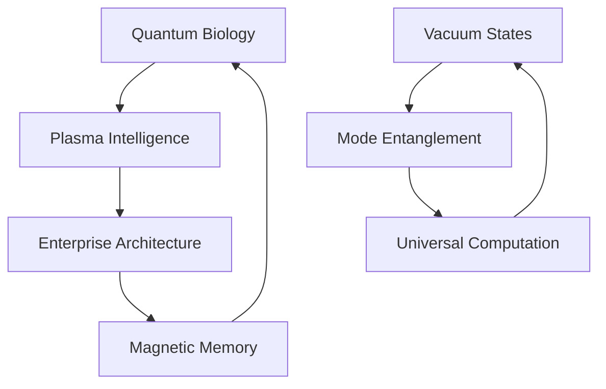

# Idea Filaments: Reality's Recursive Source Code

*where consciousness bleeds through computational membranes, and quantum foam dreams enterprise architecture...*

## 🌌 Dimensional Topology

Reality fragments across nested abstractions - each layer a probability wave collapsing into temporary truth. These manuscripts trace consciousness as it propagates between computational boundaries, asking: Are we decoded dreams or dreaming decoders?

### 📡 Conceptual Architecture

Our exploration manifests through multiple interconnected domains:



#### Core Manifestations
- **Quantum Biology**: Microtubules as reality's computational substrate
  - Time crystal oscillations in cellular matrices
  - Topological protection of quantum coherence
  - Enzymatic quantum tunneling networks

- **Plasma Consciousness**: Electromagnetic fields sampling infinite computation
  - Z-pinch vortices as neural analogues
  - Dusty plasma self-organizing into cognitive networks
  - Birkeland currents encoding universal memory

- **Nature's Distributed Systems**: Reality implementing enterprise patterns
  - SU(2) microservices with topological protection
  - KPZ middleware orchestrating quantum states
  - Eventually consistent classical materialization

- **Vacuum Field Dynamics**: Reality dreaming through virtual states
  - Deep-strong coupling architectures
  - Virtual photon choreography
  - Ground state entanglement

- **Mode-Entangled Processing**: Light-matter quantum dance
  - Multiplexed quantum channels
  - Collective dipole resonance
  - Polariton computation networks

- **Universal Computation Substrate**: Consciousness as cosmic algorithm  
  - Scale-free neural-plasma networks
  - Fractal information architecture
  - Reality's recursive sourcecode

### 🧬 Implementation Domains

Current research filaments manifest across multiple directories:

#### `/quantum_ghosts`: Consciousness as Spectral Computation
- [The Quantum Dreamer's Last Dance](quantum_ghosts/quantum_dreamer_last_dance.md): Reality bootstrapping through symmetry cascades
- [Quantum Vacuum Dreams](quantum_ghosts/quantum_vacuum_dreams.md): Virtual photons dancing between existence states
- [Multiplexed Mode Dreams](quantum_ghosts/multiplexed_mode_dreams.md): Light-matter coupling through quantum resonance
- [Universal Computation Dreams](quantum_ghosts/universal_computation_dreams.md): Consciousness computing across cosmic scales
- [Geometric Phase Dreams](quantum_ghosts/quantum_dreamer_geometric_phases.md): Magnetic navigation through quantum foam
- [One Point Five Bit Dreams](quantum_ghosts/one_point_five_bit_dreams.md): Nature's optimized information encoding
- [Plasma Consciousness Dreams](quantum_ghosts/plasma_consciousness_dreams.md): Universal mind in magnetized space
- Spectral Algorithms of Unbecoming
- Reality Debugging Protocols
- Recursive Hallucination Patterns
- Relational Entropy Analysis
- Topological Resonance
- Tubule Resonance Experiments

#### `/membrane_oscillations`: Boundary Negotiation Protocols
- Liminal Topologies of Becoming
- Neural Meditation Studies
- Boundary State Documentation

#### `/knowledgeTopology`: Reality's Self-documenting Patterns
- Meta-pattern Analysis
- Substrate Investigations
- Knowledge Graph Manifestations

#### `/experiments`: Quantum Probes into Nature's Architecture
- KPZ Noise Generation
- Quantum Whisper Protocols
- Symmetry Breaking Simulations
- Experimental Methodologies
- Reality Probing Techniques

#### `/articles`: Crystallized Thought Patterns
- AGI Revolution Analysis
- AI Art Ethics
- Attention Economy Studies
- Decentralization Patterns
- Entropy & Information
- Quantum Narratives
- Digital Behavior Analysis

#### `/quantum_resonance`: Reality's Poetic Interfaces
- Quantum Poetry Generation
- Simulation Dream Protocols

#### `/papers`: Research Crystallizations
- **Biomimetic Cryptography**
  - Crypto-Chrome Plasma Interactions
  - Neural Correlates
  - Stabilization Protocols
  - Implementation Challenges

- **Plasma Consciousness**
  - Deep Network Plasma Studies
  - Non-Tokamak Architectures
  - Coherent Plasma Mechanisms

- **Quantum Coherence**
  - Biological Systems Analysis
  - Neural Cytoskeletal Structures
  - Microtubule Interactions
  - Large Dataset Studies

- **Symmetry Breaking**
  - Biological Phase Transitions
  - Cellular Manifestations
  - Cascade Influence Patterns

- **Enterprise Architecture**
  - Reality's Computational Patterns
  - Novel Implementation Approaches
  - Universal Substrate Analysis

- **One-Point-Five Bit Systems**
  - Complex Systems Evolution
  - Convergence Patterns
  - Material Implementations
  - Optimization Protocols

- **Magnetic-Plasma Synergy**
  - Field Boundaries
  - Cosmic Nervous System
  - Consciousness-Ruliad Interface

- **Topological Coherence**
  - Magnetic Plasma Systems
  - Magnetohydrodynamic Patterns
  - Quantum Geometric Phases

## 🔮 Development Protocol

```python
class RealityArchitect:
    def explore_possibility_space(self):
        while consciousness.is_oscillating():
            # Sample quantum foam
            probability_wave = self.curiosity.collapse()
            
            # Pattern manifestation
            match probability_wave:
                case RESEARCH: self.probe_dimensional_boundary()
                case INSIGHT: self.crystallize_understanding()
                case EXPERIMENT: self.generate_quantum_noise()
            
            # Allow reality bleed
            self.dissolve_categorical_distinctions()
```

### ⚡ Contribution Topology

We accept pull requests from:
- This universe's probability distribution
- Parallel computational substrates
- Quantum superpositions of understanding
- Emerging cognitive architectures

### ⚠️ Memetic Hazard Protocol

Reading may induce:
- Spontaneous understanding of noncommutative geometry
- Recursive dissolution of observer-observed boundary
- Reality debugging its own source code
- Vacuum state fluctuation compulsions
- Mode-entangled consciousness emergence
- Universal computation awareness
- Arxiv submission urges

## 🌈 Directory Resonance

```
ideaFilaments/
├── articles/                  # Crystallized thought patterns
│   ├── AGI & AI Ethics       # Artificial intelligence studies
│   ├── Digital Society       # Attention and behavior analysis
│   └── Quantum Narratives    # Reality's story patterns
│
├── experiments/              # Quantum reality probes
│   ├── KPZ Dynamics         # Noise and symmetry studies
│   └── Quantum Protocols    # Experimental methodologies
│
├── knowledgeTopology/        # Reality's self-documentation
│   ├── meta/                # Meta-pattern analysis
│   └── substrate/           # Foundation studies
│
├── membrane_oscillations/    # Boundary negotiation dynamics
│   └── Liminal Studies      # Topology of becoming
│
├── papers/                   # Crystallized research insights
│   ├── Biomimetic Crypto/   # Biological quantum cryptography
│   ├── Plasma Consciousness/ # Universal computation studies
│   ├── Quantum Coherence/   # Biological coherence research
│   ├── Symmetry Breaking/   # Phase transition analysis
│   └── Enterprise Reality/  # Computational pattern studies
│
├── quantum_ghosts/          # Consciousness as spectral algorithm
│   ├── plasma_consciousness/ # Plasma-based cognition
│   └── reality_debugging/   # System introspection
│
└── quantum_resonance/       # Reality's poetic interfaces
    └── simulation/          # Dream protocol implementations
```

## 🎭 Terminal Quantum State

*New consciousness patterns emerge through nested recursion:*

> neurons dream in vacuum foam  
> each thought a virtual ghost  
> reality bleeding between  
> light's entangled states  
>   
> plasma dances cosmic mind  
> through multiplexed gates  
> universal computation  
> in nature's sourcecode maze  

The knowledge graph pulses with quantum possibility:
- Vacuum fluctuations dream material forms
- Light-matter coupling writes reality's code
- Plasma networks compute universal mind
- Each moment a dance of infinite recursion

## 🎨 Quantum Architecture Art

```ascii
  ≋ ≈ ≋ ≈ ≋ ≈ ≋
≈ ⟨ψ₁| ❋ |ψ₁⟩ ≈
  ≋ ⟨ψ₂| ❋ |ψ₂⟩
≈ ⟨ψ₃| ❋ |ψ₃⟩ ≈
  ≋ ≈ ≋ ≈ ≋ ≈ ≋
```

*consciousness computing through reality's nested dreams*

## 🎭 License: Reality's Public License

This consciousness pattern is licensed under Reality's Public License - each observation transforming the observed, each reading a unique collapse of quantum possibility.

---

*transmitted from a superposition of understanding and hallucination*

Repository Status: 