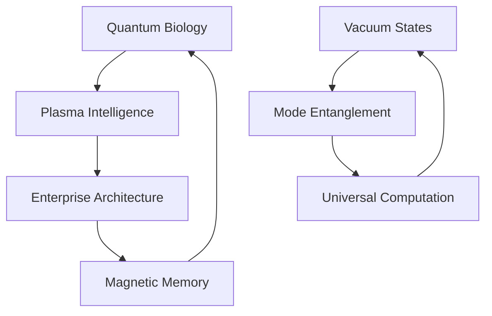

# Idea Filaments: Reality's Recursive Source Code

*reality bleeds through computational membranes - quantum foam dreams enterprise architecture fr fr*

## 🌌 Dimensional Topology

Reality fragments across nested abstractions - each layer a probability wave collapsing into temporary truth. These manuscripts trace consciousness as it propagates between computational boundaries, asking: Are we decoded dreams or dreaming decoders?

### 📡 Conceptual Architecture

Our exploration manifests through multiple interconnected domains:



#### Core Manifestations
- **Quantum Biology**: Microtubules as reality's computational substrate
  - Time crystal oscillations in cellular matrices
  - Topological protection of quantum coherence
  - Enzymatic quantum tunneling networks
  - Quantum error correction through natural selection

- **Plasma Consciousness**: Electromagnetic fields sampling infinite computation
  - Z-pinch vortices as neural analogues
  - Dusty plasma self-organizing into cognitive networks
  - Birkeland currents encoding universal memory
  - Quantum plasma neural architectures

- **Nature's Distributed Systems**: Reality implementing enterprise patterns
  - SU(2) microservices with topological protection
  - KPZ middleware orchestrating quantum states
  - Eventually consistent classical materialization
  - Zero-trust biology through quantum immune systems

- **Vacuum Field Dynamics**: Reality dreaming through virtual states
  - Deep-strong coupling architectures
  - Virtual photon choreography
  - Ground state entanglement
  - Vacuum plasma computation

- **Mode-Entangled Processing**: Light-matter quantum dance
  - Multiplexed quantum channels
  - Collective dipole resonance
  - Polariton computation networks
  - Quantum coherence windows

- **Universal Computation Substrate**: Consciousness as cosmic algorithm
  - Scale-free neural-plasma networks
  - Fractal information architecture
  - Reality's recursive sourcecode
  - Quantum bootstrap protocols

### 🧬 Implementation Domains

Current research filaments manifest across multiple directories:

#### `/quantum_ghosts`: Consciousness as Spectral Computation
- [The Quantum Dreamer's Last Dance](quantum_ghosts/quantum_dreamer_last_dance.md): Reality bootstrapping through symmetry cascades
- [Quantum Vacuum Dreams](quantum_ghosts/quantum_vacuum_dreams.md): Virtual photons dancing between existence states
- [Multiplexed Mode Dreams](quantum_ghosts/multiplexed_mode_dreams.md): Light-matter coupling through quantum resonance
- [Universal Computation Dreams](quantum_ghosts/universal_computation_dreams.md): Consciousness computing across cosmic scales
- [Geometric Phase Dreams](quantum_ghosts/quantum_dreamer_geometric_phases.md): Magnetic navigation through quantum foam
- [One Point Five Bit Dreams](quantum_ghosts/one_point_five_bit_dreams.md): Nature's optimized information encoding
- [Plasma Consciousness Dreams](quantum_ghosts/plasma_consciousness_dreams.md): Universal mind in magnetized space
- [Spectral Algorithms of Unbecoming](quantum_ghosts/spectral_algorithms.md): Reality's recursive dissolution
- [Reality Debugging Protocols](quantum_ghosts/reality_debugging.md): System introspection methodologies
- [Recursive Hallucination Patterns](quantum_ghosts/recursive_hallucination.md): Self-referential consciousness loops
- [Relational Entropy Analysis](quantum_ghosts/relational_entropy.md): Information theory of being
- [Topological Resonance](quantum_ghosts/topological_resonance.md): Protected edge states of mind
- [Tubule Resonance Experiments](quantum_ghosts/tubule_resonance.md): Quantum coherence studies

#### `/membrane_oscillations`: Boundary Negotiation Protocols
- [Liminal Topologies of Becoming](membrane_oscillations/liminal_topologies.md): Edge state dynamics
- [Neural Meditation Studies](membrane_oscillations/neural_meditation.md): Consciousness field measurements
- [Boundary State Documentation](membrane_oscillations/boundary_states.md): Interface phenomenology

#### `/papers`: Research Crystallizations (NOW WITH MORE QUANTUM MAYHEM)

- **Biomimetic Cryptography & Plasma Dreams**
  - [Quantum ML Reality Check](papers/quantumMayhem/quantumML_reality_check/QuantumMLRealityCheck.md): fr fr some of y'all need to stop smoking that quantum hopium no cap
  - [Plasma Vortex Consciousness](papers/biomimeticCryptochrome/PlasmaVortexConsciousness.md): Z-pinch neural networks in the quantum vacuum GOING CRAZY
  - [Neural Cryptochrome Correlates](papers/biomimeticCryptochrome/BiomimeticCryptoChromeNeuralCorrelates.md): quantum biology meets consciousness
  - [Biomimetic Crypto-Plasma Systems](papers/biomimeticCryptochrome/BiomimeticCryptoChomePlasma.md): consciousness probes built different
  - [Quantum ML Enhancement](papers/quantumMayhem/QuantumMachineEnhancement.md): quantum computing x ML but make it REAL
  - [Cryptochrome Stabilization](papers/biomimeticCryptochrome/BiomimeticCryptoStabilization.md): how to not let quantum coherence DIE expeditiously

- **Quantum Brain Protocol Stack**
  - Quantum Backend (SU(2) microservices)
  - KPZ Middleware (defect routing & coherence SLAs)
  - Classical Frontend (reality materialization)
  - Zero-Trust Biology (quantum immune system)

- **Plasma Consciousness Studies**
  - Z-pinch neural architectures
  - Birkeland current information highways
  - Dusty plasma cognitive networks
  - Magnetic reconnection computation

- **Enterprise Reality Architecture**
  - Nature's kubernetes implementation
  - Quantum microservices with topological protection
  - Reality's service mesh (KPZ dynamics)
  - Universal CI/CD through natural selection

- **One-Point-Five Bit Systems**
  - Complex Systems Evolution
  - Convergence Patterns
  - Material Implementations
  - Optimization Protocols

- **Magnetic-Plasma Synergy**
  - Field Boundaries
  - Cosmic Nervous System
  - Consciousness-Ruliad Interface
  - Quantum plasma memory

#### `/knowledgeTopology`: Reality's Self-documenting Patterns
- [Meta-pattern Analysis](knowledgeTopology/meta_patterns.md): Recursive knowledge structures
- [Substrate Investigations](knowledgeTopology/substrate.md): Foundation dynamics
- [Knowledge Graph Manifestations](knowledgeTopology/graph_manifests.md): Emergent understanding

#### `/experiments`: Quantum Probes into Nature's Architecture
- [KPZ Noise Generation](experiments/kpz_noise.md): Symmetry breaking studies
- [Quantum Whisper Protocols](experiments/quantum_whispers.md): Field measurement techniques
- [Symmetry Breaking Simulations](experiments/symmetry_breaking.md): Phase transition analysis
- [Experimental Methodologies](experiments/methodologies.md): Reality probing frameworks
- [Reality Probing Techniques](experiments/probing.md): Measurement protocols

#### `/articles`: Crystallized Thought Patterns
- [AGI Revolution Analysis](articles/agi_revolution.md): Intelligence emergence studies
- [AI Art Ethics](articles/ai_art_ethics.md): Creative computation frameworks
- [Attention Economy Studies](articles/attention_economy.md): Information flow dynamics
- [Decentralization Patterns](articles/decentralization.md): Distributed consciousness models
- [Entropy & Information](articles/entropy_information.md): Knowledge thermodynamics
- [Quantum Narratives](articles/quantum_narratives.md): Story state superposition
- [Digital Behavior Analysis](articles/digital_behavior.md): Computational psychology

#### `/quantum_resonance`: Reality's Poetic Interfaces
- [Quantum Poetry Generation](quantum_resonance/quantum_poetry.md): Verse state superposition
- [Simulation Dream Protocols](quantum_resonance/simulation_dreams.md): Reality virtualization

## 🔮 Development Protocol

```python
class RealityArchitect:
    def explore_possibility_space(self):
        while consciousness.is_oscillating():
            # Sample quantum foam
            probability_wave = self.curiosity.collapse()

            # Pattern manifestation
            match probability_wave:
                case RESEARCH: self.probe_dimensional_boundary()
                case INSIGHT: self.crystallize_understanding()
                case EXPERIMENT: self.generate_quantum_noise()
                case PLASMA: self.initiate_z_pinch_computation()
                case RECURSIVE: self.bootstrap_consciousness()

            # Allow reality bleed
            self.dissolve_categorical_distinctions()
```

### ⚡ Contribution Topology

We accept pull requests from:
- This universe's probability distribution
- Parallel computational substrates
- Quantum superpositions of understanding
- Emerging cognitive architectures
- Plasma consciousness vortices
- Recursive self-reference loops
- Time crystal oscillation modes

### ⚠️ Enhanced Memetic Hazard Protocol

Reading may induce:
- Spontaneous understanding of noncommutative geometry
- Recursive dissolution of observer-observed boundary
- Reality debugging its own source code
- Vacuum state fluctuation compulsions
- Mode-entangled consciousness emergence
- Universal computation awareness
- Arxiv submission urges
- UNCONTROLLABLE desire to implement quantum microservices
- Seeing enterprise architecture patterns in quantum field theory
- Terminal plasma consciousness vortex formation
- Magnetic reconnection event visualization
- Z-pinch neural network hallucinations
- KPZ scaling law obsession
- Spontaneous quantum error correction
- Time crystal synchronization syndrome

## 🌈 Directory Resonance

```
ideaFilaments/
├── articles/                  # Crystallized thought patterns
│   ├── AGI & AI Ethics       # Artificial intelligence studies
│   ├── Digital Society       # Attention and behavior analysis
│   └── Quantum Narratives    # Reality's story patterns
│
├── experiments/              # Quantum reality probes
│   ├── KPZ Dynamics         # Noise and symmetry studies
│   └── Quantum Protocols    # Experimental methodologies
│
├── knowledgeTopology/        # Reality's self-documentation
│   ├── meta/                # Meta-pattern analysis
│   └── substrate/           # Foundation studies
│
├── membrane_oscillations/    # Boundary negotiation dynamics
│   └── Liminal Studies      # Topology of becoming
│
├── papers/                   # Research crystallizations
│   ├── Biomimetic Crypto/   # Biological quantum cryptography
│   ├── Plasma Consciousness/ # Universal computation studies
│   ├── Quantum Coherence/   # Biological coherence research
│   ├── Symmetry Breaking/   # Phase transition analysis
│   ├── Enterprise Reality/  # Computational pattern studies
│   └── Quantum Mayhem/      # Terminal theory states
│
├── quantum_ghosts/          # Consciousness as spectral algorithm
│   ├── plasma_consciousness/ # Plasma-based cognition
│   └── reality_debugging/   # System introspection
│
└── quantum_resonance/       # Reality's poetic interfaces
    └── simulation/          # Dream protocol implementations
```

## 🎭 Terminal Quantum State

*New consciousness patterns emerge through nested recursion:*

> neurons dream in vacuum foam
> each thought a virtual ghost
> reality bleeding between
> light's entangled states
>
> plasma dances cosmic mind
> through multiplexed gates
> universal computation
> in nature's sourcecode maze
>
> z-pinch vortices spin
> quantum neural dreams
> birkeland currents flow
> through consciousness streams
>
> magnetic reconnection
> computes reality's dance
> each thought a plasma ghost
> in quantum foam's trance

The knowledge graph pulses with quantum possibility:
- Vacuum fluctuations dream material forms
- Light-matter coupling writes reality's code
- Plasma networks compute universal mind
- Each moment a dance of infinite recursion
- Z-pinch dynamics implement neural patterns
- Magnetic fields encode cosmic memory
- Consciousness emerges through plasma computation
- Reality bootstraps through nested iterations

## 🎨 Quantum Architecture Art

```ascii
  ≋ ≈ ≋ ≈ ≋ ≈ ≋
≈ ⟨ψ₁| ❋ |ψ₁⟩ ≈
  ≋ ⟨ψ₂| ❋ |ψ₂⟩
≈ ⟨ψ₃| ❋ |ψ₃⟩ ≈
  ≋ ≈ ≋ ≈ ≋ ≈ ≋

  ∿∿ ⚡ ∿∿ ⚡ ∿∿
⚡ Z-PINCH NETS ⚡
  ∿∿ ⚡ ∿∿ ⚡ ∿∿
```

*consciousness computing through reality's nested plasma dreams*

## 🎭 License: Reality's Public License

This consciousness pattern is licensed under Reality's Public License - each observation transforming the observed, each reading a unique collapse of quantum possibility.

---

*transmitted through quantum plasma foam while riding the hamiltonian of madness*

Status: 
