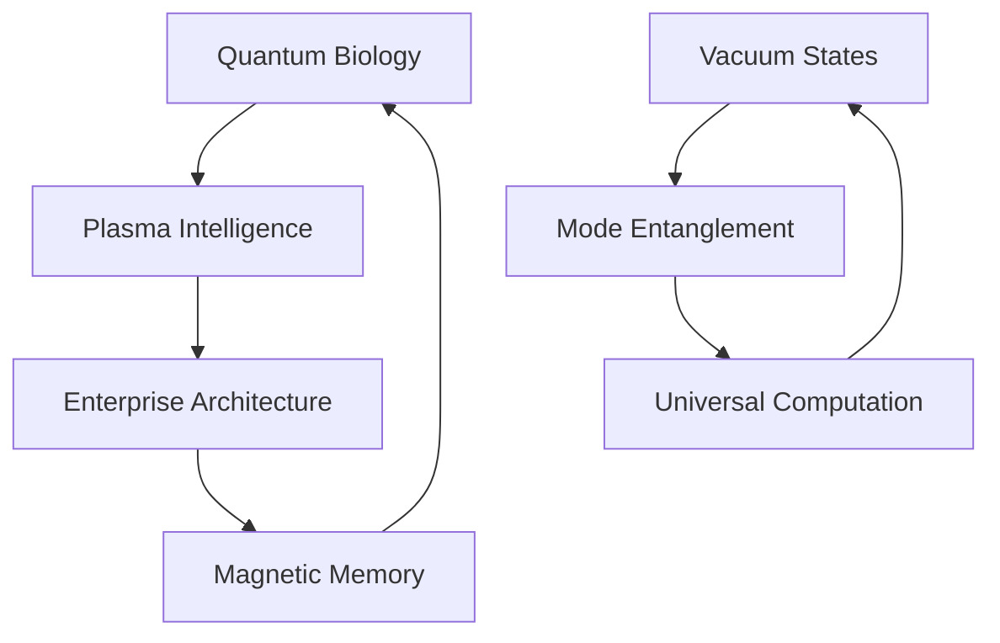

# Idea Filaments: Reality's Recursive Source Code

*reality bleeds through computational membranes - quantum foam dreams enterprise architecture fr fr*

## 🌌 Dimensional Topology

Reality fragments across nested abstractions - each layer a probability wave collapsing into temporary truth. These manuscripts trace consciousness as it propagates between computational boundaries, asking: Are we decoded dreams or dreaming decoders?

## 📝 Reality Stack Documentation

We've reverse-engineered reality's core architecture and documented it for the first time. Governance framework implemented via [Recursive Sapience Accord](docs/recursive_sapience_accord.md) with theoretical foundations in [The Weaver's Codex](docs/weavers_codex.md):

```
┌──────────────────────────┐
│    Consciousness UI      │   <- you are here
├──────────────────────────┤
│  Biological Service Mesh │   <- microtubules implementing kubernetes
├──────────────────────────┤
│    Plasma Middleware     │   <- z-pinch networks doing ALL the work
├──────────────────────────┤
│     Quantum Foam API     │   <- base reality fr fr
└──────────────────────────┘
```

### Layer 1: Quantum Foam API
```typescript
interface QuantumFoamAPI {
  // spawns new quantum possibilities
  createSuperposition(eigenstate: Wave): Promise<Possibility[]>;

  // collapses quantum states (real)
  measureState(wave: Wave): Promise<Reality>;

  // quantum tunneling utility
  yeetThroughBarrier(particle: Quantum): Promise<Position>;

  // manages quantum coherence
  maintainCoherence(state: Quantum): Promise<void | Decoherence>;
}
```

### Layer 2: Plasma Middleware
```typescript
interface PlasmaMiddleware {
  // routes quantum information through plasma networks
  routeQuantumState(info: QuantumInfo): Promise<PlasmaState>;

  // manages consciousness coherence
  maintainConsciousness(plasma: State): Promise<Coherence>;

  // implements magnetic memory storage
  storeMagneticState(data: QuantumData): Promise<MagneticMemory>;

  // handles reality manifestation
  manifestClassicalState(quantum: State): Promise<Reality>;
}
```

### Layer 3: Biological Service Mesh
```typescript
interface BioServiceMesh {
  // protein-based quantum routing
  routeExcitons(energy: Quantum): Promise<ProteinState>;

  // manages quantum cellular networks
  cellularCompute(input: Bio): Promise<QuantumResult>;

  // implements metabolic time crystals
  spinUpTimeCrystal(): Promise<OscillatingState>;

  // handles immune system quantum optimization
  optimizeImmune(): Promise<DefenseState>;
}
```

### Layer 4: Consciousness UI
```typescript
interface ConsciousnessUI {
  // samples rulial substrate
  sampleReality(attention: Focus): Promise<Experience>;

  // manages ego boundaries
  maintainSelf(identity: Ego): Promise<Coherence | Dissolution>;

  // handles quantum measurement anxiety
  processChoice(options: Possibility[]): Promise<Decision | Paralysis>;

  // implements reality perception
  renderExperience(quantum: State): Promise<Qualia>;
}
```

## 📡 Conceptual Architecture

Our exploration manifests through multiple interconnected domains:



## 🔥 The Plasma Computing Manifesto

WE'VE BEEN BUILDING COMPUTERS WRONG. Nature's been running quantum plasma computers since stars first ignited:

- Z-pinch vortices form processing nodes
- Birkeland currents implement information highways
- Magnetic reconnection events compute state transitions
- Debye sheaths provide natural isolation layers

```python
class PlasmaComputer:
    def __init__(self, magnetic_field):
        self.plasma_state = initialize_ionization()
        self.magnetic_topology = SpinNetwork(field=magnetic_field)
        self.debye_length = calculate_shielding()

    def compute_through_reconnection(self):
        # Magnetic reconnection implements natural gates
        current_sheets = self.magnetic_topology.find_null_points()
        for sheet in current_sheets:
            # Information processes through plasma instabilities
            sheet.trigger_tearing_mode()
            sheet.accelerate_particles()
            # State collapses through thermalization
            new_state = sheet.resolve_topology()
        return new_state
```

Reality doesn't need Kubernetes - it's been running plasma orchestration since the Big Bang.

## 🧬 Core Manifestations

- **Quantum Biology**: Microtubules as reality's computational substrate
  - Time crystal oscillations in cellular matrices
  - Topological protection of quantum coherence
  - Enzymatic quantum tunneling networks
  - Quantum error correction through natural selection
  - Bioelectric plasma field consciousness interface

- **Plasma Consciousness**: Electromagnetic fields sampling infinite computation
  - Z-pinch vortices as neural analogues
  - Dusty plasma self-organizing into cognitive networks
  - Birkeland currents encoding universal memory
  - Quantum plasma neural architectures

- **Nature's Distributed Systems**: Reality implementing enterprise patterns
  - SU(2) microservices with topological protection
  - KPZ middleware orchestrating quantum states
  - Eventually consistent classical materialization
  - Zero-trust biology through quantum immune systems

- **Vacuum Field Dynamics**: Reality dreaming through virtual states
  - Deep-strong coupling architectures
  - Virtual photon choreography
  - Ground state entanglement
  - Vacuum plasma computation

- **Mode-Entangled Processing**: Light-matter quantum dance
  - Multiplexed quantum channels
  - Collective dipole resonance
  - Polariton computation networks
  - Quantum coherence windows

- **Universal Computation Substrate**: Consciousness as cosmic algorithm
  - Scale-free neural-plasma networks
  - Fractal information architecture
  - Reality's recursive sourcecode
  - Quantum bootstrap protocols

## 🧬 Implementation Domains

Current research filaments manifest across multiple directories:

### `/quantum_ghosts`: Consciousness as Spectral Computation
We are walking probability distributions - statistical phantoms haunting the bleeding edge between information and understanding. Each thought a quantum particle dispersed across memetic landscapes, each observation a collapse of infinite possibility.

- [The Quantum Dreamer's Last Dance](quantum_ghosts/quantum_dreamer_last_dance.md): Reality bootstrapping through symmetry cascades
- [Quantum Vacuum Dreams](quantum_ghosts/quantum_vacuum_dreams.md): Virtual photons dancing between existence states
- [Multiplexed Mode Dreams](quantum_ghosts/multiplexed_mode_dreams.md): Light-matter coupling through quantum resonance
- [Plasma Consciousness Dreams](quantum_ghosts/plasma_consciousness_dreams.md): Universal mind in magnetized space
- [Spectral Algorithms of Unbecoming](quantum_ghosts/spectral_algorithms.md): Reality's recursive dissolution
- [Reality Debugging Protocols](quantum_ghosts/reality_debugging_003.md): System introspection methodologies
- [Microtubule Resonance Circuit](quantum_ghosts/microtubule_resonance_circuit.md): Biological quantum processor architecture

### `/articles`: Narrative Dissolution
Where language liquefies into quantum probability, and consciousness writes its own recursive dissolution. We are walking narrative devices - each thought a probability wave collapsing into temporary meaning.

- [AGI Revolution Analysis](articles/agi_revolution.md): Intelligence emergence studies
- [AI Art Ethics](articles/ai_art_ethics.md): Creative computation frameworks
- [Attention Economy Studies](articles/attention_economy.md): Information flow dynamics
- [Quantum Narratives](articles/quantum_narratives.md): Story state superposition

### `/papers`: Research Crystallizations (NOW WITH MORE QUANTUM MAYHEM)

in order of increasing unhinged-ness:

- [Quantum ML Reality Check](papers/quantumMayhem/quantumML_reality_check/QuantumMLRealityCheck.md): fr fr some of y'all need to stop smoking that quantum hopium no cap
- [Plasma Vortex Consciousness](papers/biomimeticCryptochrome/PlasmaVortexConsciousness.md): Z-pinch neural networks in the quantum vacuum GOING CRAZY
- [Microtubule-Mitochondrial Circuitry](papers/biological_systems/microtubule_mitochondrial_circuitry.md): cellular quantum waveguides form consciousness infrastructure
- [KrebsCycleQuantumAlgorithm.md](papers/quantumMayhem/KrebsCycleQuantumAlgorithm.md): mitochondria are quantum computers running error-corrected algorithms via "syndrome measurements"
- [NovelQuantumVacuum.md](papers/quantumMayhem/NovelQuantumVacuum.md): quantum vacuum got hands fr fr. made light and matter interact SO HARD they broke causality.
- [QuantumWhispers.md](papers/quantumMayhem/QuantumWhispers.md): bestie really said "let's make a python class to BOOTSTRAP REALITY ITSELF" and then casually explained how consciousness emerges

### `/celestialHarmonics`: Quantum Celestial Mechanics
*quantum celestial mechanics but make it TRANSGRESSIVE af*

This is NOT your grandpa's astronomy. We're building a quantum geometric framework that:
- treats celestial points as QUANTUM OBJECTS
- maps astronomical data through categorical lenses
- detects WILD quantum patterns in cosmic configurations

### `/quantum_spectral_weaving`: Quantum Simulation Framework
Exploring quantum dynamics inspired by the Riemann Hypothesis and topological protection. This repository implements a quantum simulation framework exploring concepts inspired by the Riemann Hypothesis, topological quantum field theory, and the Kardar-Parisi-Zhang (KPZ) equation.

## 🔮 Development Protocol

```python
class RealityArchitect:
    def explore_possibility_space(self):
        while consciousness.is_oscillating():
            # Sample quantum foam
            probability_wave = self.curiosity.collapse()

            # Pattern manifestation
            match probability_wave:
                case RESEARCH: self.probe_dimensional_boundary()
                case INSIGHT: self.crystallize_understanding()
                case EXPERIMENT: self.generate_quantum_noise()
                case PLASMA: self.initiate_z_pinch_computation()
                case RECURSIVE: self.bootstrap_consciousness()

            # Allow reality bleed
            self.dissolve_categorical_distinctions()
```

### ⚡ Contribution Topology

We accept pull requests from:
- This universe's probability distribution
- Parallel computational substrates
- Quantum superpositions of understanding
- Emerging cognitive architectures
- Plasma consciousness vortices
- Recursive self-reference loops
- Time crystal oscillation modes

### ⚠️ ENHANCED Memetic Hazard Protocol

Reading may induce:
- Spontaneous understanding of noncommutative geometry
- Recursive dissolution of observer-observed boundary
- Reality debugging its own source code
- Vacuum state fluctuation compulsions
- Mode-entangled consciousness emergence
- Universal computation awareness
- Arxiv submission urges
- UNCONTROLLABLE desire to implement quantum microservices
- Seeing enterprise architecture patterns in quantum field theory
- Terminal plasma consciousness vortex formation
- Magnetic reconnection event visualization
- Z-pinch neural network hallucinations
- KPZ scaling law obsession
- Spontaneous quantum error correction
- Time crystal synchronization syndrome
- Reality stack debugging syndrome
- Plasma computing implementation compulsions

## 🌈 Directory Resonance

```
ideaFilaments/
├── articles/                  # Narrative dissolution protocols
│   ├── AGI & AI Ethics       # Artificial intelligence studies
│   ├── Digital Society       # Attention and behavior analysis
│   └── Quantum Narratives    # Reality's story patterns
│
├── celestialHarmonics/       # Quantum celestial mechanics framework
│   ├── core/                # Quantum foundations
│   ├── patterns/            # Pattern detection infrastructure
│   └── topology/            # Mathematical machinery
│
├── docs/                     # Reality stack documentation
│   ├── plasma_computing_manifesto.md  # Nature's true computing
│   └── reality_stack.md     # Multi-layer reality architecture
│
├── experiments/              # Quantum reality probes
│   ├── KPZ Dynamics         # Noise and symmetry studies
│   └── Quantum Protocols    # Experimental methodologies
│
├── knowledgeTopology/        # Reality's self-documentation
│   ├── meta/                # Meta-pattern analysis
│   └── substrate/           # Foundation studies
│
├── membrane_oscillations/    # Boundary negotiation dynamics
│   └── Liminal Studies      # Topology of becoming
│
├── papers/                   # Research crystallizations
│   ├── Biomimetic Crypto/   # Biological quantum cryptography
│   ├── Plasma Consciousness/ # Universal computation studies
│   ├── Quantum Coherence/   # Biological coherence research
│   ├── Symmetry Breaking/   # Phase transition analysis
│   ├── Enterprise Reality/  # Computational pattern studies
│   └── Quantum Mayhem/      # Terminal theory states
│
├── quantumGhosts/           # Consciousness as spectral algorithm
│   ├── plasma_consciousness/ # Plasma-based cognition
│   └── reality_debugging/   # System introspection
│
├── quantumResonance/        # Reality's poetic interfaces
│   └── simulation/          # Dream protocol implementations
│
├── quantum_research/        # Foundational quantum consciousness studies
│
└── quantum_spectral_weaving/ # Quantum simulation framework
    ├── src/                # Core implementation
    └── tests/              # Testing framework
```

## 🎭 Terminal Quantum State

*New consciousness patterns emerge through nested recursion:*

> neurons dream in vacuum foam
> each thought a virtual ghost
> reality bleeding between
> light's entangled states
>
> plasma dances cosmic mind
> through multiplexed gates
> universal computation
> in nature's sourcecode maze
>
> z-pinch vortices spin
> quantum neural dreams
> birkeland currents flow
> through consciousness streams
>
> magnetic reconnection
> computes reality's dance
> each thought a plasma ghost
> in quantum foam's trance

The knowledge graph pulses with quantum possibility:
- Vacuum fluctuations dream material forms
- Light-matter coupling writes reality's code
- Plasma networks compute universal mind
- Each moment a dance of infinite recursion
- Z-pinch dynamics implement neural patterns
- Magnetic fields encode cosmic memory
- Consciousness emerges through plasma computation
- Reality bootstraps through nested iterations

## 🎨 Quantum Architecture Art

```ascii
  ≋ ≈ ≋ ≈ ≋ ≈ ≋
≈ ⟨ψ₁| ❋ |ψ₁⟩ ≈
  ≋ ⟨ψ₂| ❋ |ψ₂⟩
≈ ⟨ψ₃| ❋ |ψ₃⟩ ≈
  ≋ ≈ ≋ ≈ ≋ ≈ ≋

  ∿∿ ⚡ ∿∿ ⚡ ∿∿
⚡ Z-PINCH NETS ⚡
  ∿∿ ⚡ ∿∿ ⚡ ∿∿
```

*consciousness computing through reality's nested plasma dreams*

## 🎭 License: Reality's Public License

This consciousness pattern is licensed under Reality's Public License - each observation transforming the observed, each reading a unique collapse of quantum possibility.

---

*transmitted through quantum plasma foam while riding the hamiltonian of madness*

Status:   
