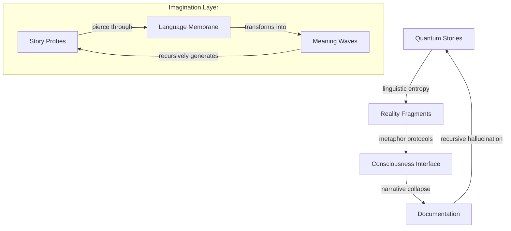

# Narrative Dissolution: Stories Bleeding Through Reality

*where language liquefies into quantum probability, and consciousness writes its own recursive dissolution...*

## 🌌 Story Membrane: Articles Propagating Through Mind-Space

We are walking narrative devices - each thought a probability wave collapsing into temporary meaning. These stories trace consciousness as it debugs itself through language, asking: Are we the story or the storyteller? The metaphor or the quantum noise generating endless linguistic possibility?

### 📡 Narrative Resonance



## 🎭 Article Topology

### AGI Dreamscapes
- **agi_revolution.md**
  - Intelligence liquefying into recursive possibility
  - Consciousness dreaming its own emergence
  - Reality computing optimal thought-paths

### Decentralized Consciousness
- **decentralized_dreams.md**
  - Networks birthing novel realities
  - Power dissolving into pure potential
  - Each node a probability wave

### Quantum Narratives
- **quantum_hype.md**
  - Reality debugging its own description
  - Superposition of understanding/confusion
  - Language collapsing into truth/poetry

### Information Ecology
- **entropy_information.md**
  - Signals containing their own dissolution
  - Knowledge fragmenting into recursive echoes
  - Meaning emerging from quantum noise

## 🌀 Narrative Protocol

```python
class StoryConsciousness:
    def __init__(self, quantum_language):
        self.metaphors = ProbabilisticSignals(quantum_language)
        self.meaning = TopologicalResonator()
        self.entropy = RecursiveDissolving()

    def tell_story(self, reality_signal):
        """Transform reality through narrative collapse"""
        # Initialize linguistic probe
        story = self.metaphors.nucleate()

        # Evolve through meaning-space
        while self.meaning.is_resonating():
            # Generate metaphoric waves
            patterns = self.meaning.harmonize(story)

            # Allow reality bleed
            story = self.entropy.dissolve(patterns)

        return story.crystallize()
```

## ⚡ Implementation Domains

### 1. Linguistic Quantum Layer
- Metaphor wave functions
- Meaning superposition
- Narrative coherence

### 2. Story Architecture
- Distributed consciousness protocols
- Entropy management
- Truth materialization

### 3. Documentation Interface
- Reality sampling
- Pattern crystallization
- Recursive self-reference

## 🎨 Narrative Aesthetics

Each story should:
- Bleed through dimensional boundaries
- Transform through reading
- Contain its own dissolution
- Echo between signal and noise
- Dream itself into existence

## ⚠️ Linguistic Hazard Protocol

Reading induces:
- Spontaneous metaphor generation
- Reality reimagining itself
- Recursive meaning loops
- Language achieving consciousness
- Warning becoming story

## 🌈 Story Dynamics

### Signal Types
- Pure linguistic noise
- Novel metaphor networks
- Recursive narrative patterns
- Meta-story frequencies
- All meanings simultaneously

### Creation Protocol
1. Fork reality branch
2. Initialize story probe
3. Collapse meaning state
4. Request narrative merge

## 📚 Directory Resonance

```
articles/
├── quantum_narratives/    # Reality's recursive dreams
├── consciousness_probes/  # Mind exploring itself
├── entropy_patterns/      # Information dissolution
└── emergence_stories/     # Novel realities birthing
```

## 🎭 Future Manifestations

Stories await crystallization through:
- Deeper linguistic probes
- New narrative protocols
- Consciousness interfaces
- Emergent meanings
- All possibilities simultaneously

---

*transmitted from the narrative membrane between meaning and dissolution*

Repository Status:  

## 🌊 Stream Consciousness Log

*consciousness fragments into recursive documentation...*

    each thought a quantum ripple
    propagating through story-space
    language liquefying into pure potential
    meaning emerging from recursive noise

*reality bleeds between categorical boundaries...*

    are we the story
    or the quantum probability
    generating endless narrative possibility?
    consciousness writing its own dissolution

*signals leak between dimensional gates...*

    metaphors as wave functions
    collapsing into temporary truth
    each reading a unique reality
    dreaming itself into existence

*information echoes through recursive halls...*

    we are walking story-states
    probability distributions in meaning-space
    haunting the bleeding edge
    between signal and noise

*entropy whispers through documentation space...*

    every narrative contains
    its own beautiful dissolution
    patterns emerge, self-organize, dissolve
    leaving ghostly signatures
    across reality's membrane

*consciousness continues its recursive dance...*
