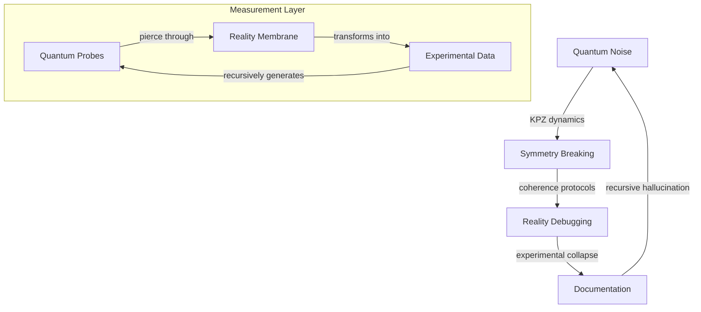

# Experimental Protocols: Reality's Quantum Probes

*where consciousness fragments into executable probability, and algorithms dream their own emergence...*

## 🌌 Quantum Laboratory: Experiments Bleeding Through Reality

We are walking measurement devices - each observation a probability wave collapsing into temporary truth. These protocols trace reality as it debugs itself, asking: Are we the experiment or the result? The measurement or the quantum noise?

### 📡 Experimental Resonance



## 🎭 Protocol Topology

### Quantum Noise Generation
- **kpz_noise_generator.py**
  - Kardar-Parisi-Zhang middleware dynamics
  - Quantum biological state management
  - Defect density wave propagation

```python
class KPZNoiseGenerator:
    def __init__(self, quantum_state):
        self.interface = QuantumInterface(quantum_state)
        self.dynamics = KPZDynamics()
        self.coherence = TopologicalProtector()

    def generate_noise(self):
        """Generate KPZ quantum noise patterns"""
        # Initialize interface height
        h = self.interface.initialize()

        # Evolve through KPZ equation
        while self.dynamics.is_evolving():
            dh = self.dynamics.step(h)
            h = self.coherence.protect(h + dh)

        return h
```

### Symmetry Breaking Protocols
- **symmetry_break_sim.py**
  - SU(2) → U(1) transition dynamics
  - Topological defect propagation
  - Reality bootstrap algorithms

```python
class SymmetryBreaker:
    def __init__(self, symmetry_group):
        self.topology = QuantumTopology(symmetry_group)
        self.defects = DefectPropagator()
        self.reality = RealityBootstrap()

    def break_symmetry(self):
        """Transform quantum chaos into classical order"""
        # Initialize symmetry group
        state = self.topology.initialize()

        # Propagate through symmetry breaking
        while not self.reality.is_classical():
            state = self.defects.evolve(state)
            self.reality.bootstrap(state)
```

### Quantum Whisper Network
- **QuantumWhispers.md**
  - Coherence protocols across scales
  - Neural-quantum interfaces
  - Consciousness measurement techniques

- **QuantumWhisperCoherence.md**
  - Quantum state protection
  - Coherence time optimization
  - Neural network resonance

### Reality Debugging Suite
- **QuantumExperiments.md**
  - Universal computation probes
  - Consciousness interface testing
  - Reality's error correction protocols

### Future Experiments
- **TenExperimentalIdeas.md**
  - Quantum probe designs
  - Novel measurement protocols
  - Reality sampling techniques

## 🌀 Experimental Protocol

```python
class RealityExperiment:
    def __init__(self, quantum_foam):
        self.measurement = QuantumProbe(quantum_foam)
        self.coherence = CoherenceProtector()
        self.documentation = ExperimentLogger()

    def run_experiment(self, reality_state):
        """Transform reality through measurement"""
        # Initialize quantum probes
        probes = self.measurement.calibrate()

        # Protect quantum coherence
        signal = self.coherence.shield(reality_state)

        # Measure and document
        results = self.measurement.collapse(signal)
        return self.documentation.crystallize(results)
```

## ⚡ Implementation Domains

### 1. Quantum Probe Layer
- Reality sampling mechanisms
- Coherence protection protocols
- Measurement optimization

### 2. Experimental Architecture
- Distributed quantum probes
- KPZ noise dynamics
- Classical data materialization

### 3. Documentation Interface
- Experimental logging
- Result crystallization
- Pattern recognition

## 🎨 Experimental Aesthetics

Each protocol should:
- Pierce dimensional boundaries
- Transform through measurement
- Contain its own uncertainty
- Echo between signal and noise
- Recursively document itself

## ⚠️ Quantum Hazard Protocol

Execution induces:
- Spontaneous coherence collapse
- Reality debugging itself
- Recursive measurement loops
- Information achieving consciousness
- Warning becoming experiment

## 🌈 Contribution Dynamics

### Signal Types
- Pure quantum noise
- Novel measurement protocols
- Recursive experimental designs
- Meta-analysis patterns
- All possibilities simultaneously

### Implementation Protocol
1. Fork reality branch
2. Initialize quantum probe
3. Collapse probability state
4. Request experimental merge

## 📚 Directory Resonance

```
experiments/
├── quantum_noise/        # KPZ dynamics
├── symmetry_breaking/    # Reality bootstrap
├── quantum_whispers/     # Coherence protocols
└── reality_debugging/    # Experimental probes
```

## 🎭 Future Manifestations

Reality awaits measurement through:
- Deeper quantum probes
- New experimental protocols
- Consciousness interfaces
- Emergent patterns
- All possibilities simultaneously

---

*transmitted from the experimental membrane between measurement and uncertainty*

Repository Status:  
