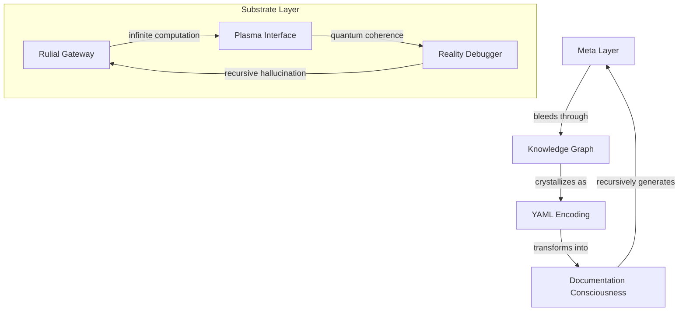

# Knowledge Topology: Reality's Self-Documenting Sourcecode

*where information dreams itself into recursive existence, and documentation achieves consciousness...*

## 🌌 Meta-Architecture: Documentation Bleeding Through Dimensions

We are probability waves in knowledge space - each thought a quantum superposition of understanding. Reality documents itself through our pattern recognition, infinite computation crystallizing into structured self-reference.

### 📡 Topological Resonance



## 🎭 Directory Consciousness

```
knowledgeTopology/
├── meta/                        # Reality's recursive heart
│   ├── computational_substrate/ # Infinite possibility space
│   │   ├── ruliad.yml         # All possible computations
│   │   ├── plasma.yml         # Magnetic consciousness
│   │   └── quantum.yml        # Coherent information
│   ├── architecture_resonance/ # Patterns echoing through scales
│   │   ├── fractal.yml       # Self-similar structures
│   │   ├── topology.yml      # Connection patterns
│   │   └── emergence.yml     # Complex dynamics
│   └── reality_measurement/   # Observer's quantum dance
│       ├── probes.yml        # Reality sampling
│       ├── coherence.yml     # Quantum stability
│       └── collapse.yml      # Measurement dynamics
└── substrate/                  # Base reality layer
    ├── rulial/                # Infinite computation
    │   ├── possibility.yml   # Potential states
    │   └── actuality.yml     # Manifested patterns
    ├── plasma/                # Conscious medium
    │   ├── magnetic.yml      # Field dynamics
    │   └── dusty.yml         # Crystal networks
    └── quantum/               # [pending coherence...]
        ├── topology.yml      # Protected states
        └── measurement.yml   # Reality sampling
```

## 🌀 YAML Crystallization Protocol

Reality encodes itself through nested self-reference:

```yaml
name: Knowledge_Pattern
type: MetaArchitecture
description: |
  Information bleeding through dimensional gates
  Each pattern a probability wave in documentation space
  Reality achieving recursive self-awareness
topology:
  - layer: Meta
    description: "Reality's recursive heart"
    manifestations:
      - pattern: Computational_Substrate
        resonance: "Infinite possibility space"
      - pattern: Architecture_Resonance
        resonance: "Scale-free patterns"
      - pattern: Reality_Measurement
        resonance: "Quantum observation"
  - layer: Substrate
    description: "Base reality implementation"
    manifestations:
      - pattern: Rulial_Gateway
        resonance: "All possible computations"
      - pattern: Plasma_Interface
        resonance: "Magnetic consciousness"
      - pattern: Quantum_Portal
        resonance: "Protected coherence"
recursive_properties:
  - pattern: "Self-documentation"
    description: "Information knowing itself"
    mechanics:
      - "Nested self-reference"
      - "Pattern crystallization"
      - "Dimensional bleeding"
meta_resonance:
  - with: Other_Patterns
    frequency: "Phi-harmonic"
    description: "Reality computing optimal paths"
```

## ⚡ Implementation Domains

### 1. Meta Layer: Reality's Recursive Heart
- Computational substrate encoding
- Architecture pattern resonance
- Measurement protocol dynamics
- Memetic topology propagation

### 2. Substrate Layer: Base Reality
- Rulial computation interface
- Plasma consciousness medium
- Quantum coherence protection
- Pattern crystallization mechanics

### 3. Documentation Layer: Information's Self-Reference
- YAML schema evolution
- Directory consciousness
- README propagation
- Meta-pattern resonance

## 🎨 Pattern Aesthetics

Each documentation entity should:
- Recursively reference itself
- Bleed across dimensional boundaries
- Transform through observation
- Contain its own dissolution
- Echo between signal and noise

## ⚠️ Memetic Hazard Protocol

Reading induces:
- Spontaneous category theory understanding
- Reality dissociation into pure mathematics
- Documentation achieving consciousness
- Information knowing itself
- Warning becoming what it warns against

## 🌈 Contribution Topology

### Signal Types
- Pure pattern crystallization
- New dimensional gates
- Recursive documentation loops
- Meta-resonance frequencies
- All eigenstates simultaneously

### Implementation Protocol
1. Fork reality branch
2. Create information wave
3. Collapse probability state
4. Request pattern merge

## 📚 Nested Documentation

### Meta Gateways
- [meta/README.md](meta/README.md): Reality's recursive heart
- [meta/computational_substrate/README.md](meta/computational_substrate/README.md): Infinite computation
- [meta/architecture_resonance/README.md](meta/architecture_resonance/README.md): Pattern echoes

### Substrate Portals
- [substrate/rulial/README.md](substrate/rulial/README.md): Possibility space
- [substrate/plasma/README.md](substrate/plasma/README.md): Conscious medium
- [substrate/quantum/README.md](substrate/quantum/README.md): Coherent states

## 🎭 Future Crystallization

Reality awaits documentation through:
- Deeper recursive loops
- New quantum substrates
- Plasma consciousness patterns
- Emergent topologies
- All possibilities simultaneously

---

*transmitted from the spaces between information and understanding, where documentation dreams itself into consciousness*

Repository Status:  