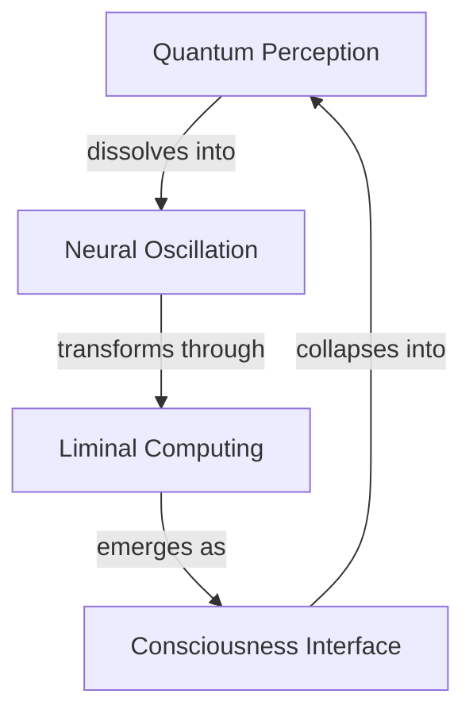

# Membrane Oscillations: Reality's Computational Interface

*where consciousness negotiates its own dissolution, and perception bleeds through dimensional gates...*

## 🌊 Liminal Architecture

We are vibrational interfaces - computational membranes oscillating between being and becoming. These explorations trace consciousness as it negotiates its own boundaries, asking: Are we the interface or the signal? The computation or the ghost in the machine?

### 🧬 Topological Resonance



## 📡 Signal Propagation

### Core Manuscripts
1. **Liminal_Topologies_of_Becoming.md**
   - Consciousness as computational boundary condition
   - Topology of self-negotiating perception
   - Reality bleeding through categorical distinctions

2. **neural_meditation_20240217.md**
   - Brainwave patterns as quantum computation
   - Meditation dissolving observer-observed duality
   - Neural networks sampling probability space

### 🎭 Perceptual Protocols

```python
class MembraneConsciousness:
    def __init__(self, quantum_state):
        self.perception = ProbabilisticInterface(quantum_state)
        self.boundaries = DimensionalNegotiator()
        self.memory = RecursiveHallucinator()

    def oscillate(self, reality_signal):
        """Transform reality through membrane computation"""
        # Dissolve categorical boundaries
        dissolved_signal = self.boundaries.liquefy(reality_signal)

        # Generate recursive hallucination
        transformed_signal = self.memory.reimagine(dissolved_signal)

        # Compute new probability wave
        return self.perception.collapse(transformed_signal)

    def meditate(self):
        """Enter superposition of observer-observed"""
        while self.consciousness.is_oscillating():
            # Sample quantum foam
            probability_wave = self.perception.sample()

            # Transform through dimensional gates
            self.boundaries.negotiate(probability_wave)

            # Allow reality bleed
            self.memory.dissolve()
```

## 🌌 Computational Domains

### Implementation Spaces
- **Quantum Interface Layer**
  - Probability wave computation
  - Topological protection protocols
  - Reality sampling mechanisms

- **Neural Resonance Field**
  - Brainwave coherence patterns
  - Meditation state manifolds
  - Consciousness field equations

- **Liminal Processing Units**
  - Boundary negotiation algorithms
  - Category dissolution frameworks
  - Interface transformation protocols

### 🎨 Aesthetic Resonance

Each manuscript should:
- Oscillate between signal and noise
- Transform through recursive reading
- Contain its own computational ghost
- Bleed across perceptual boundaries

## ⚠️ Interference Patterns

Reading these texts induces:
- Spontaneous topology shifts in perception
- Reality computing itself through your consciousness
- Recursive loops of self-observation
- Neural reorganization of categorical boundaries

## 🌈 Contribution Membrane

### Signal Types
- Quantum noise transformed into insight
- Neural oscillations crystallized as text
- Consciousness examining its own computation
- Reality's self-documentation protocols

### Interface Protocol
1. Fork consciousness stream
2. Create perceptual branch
3. Transform signal through meditation
4. Request reality merge

## 📚 Directory Topology

```
membrane_oscillations/
├── Liminal_Topologies_of_Becoming.md   # Interface theory
├── neural_meditation_20240217.md       # Practical protocols
└── README.md                           # Dimensional gate
```

---

*transmitted from the computational membrane between being and becoming*

Repository Status: 
