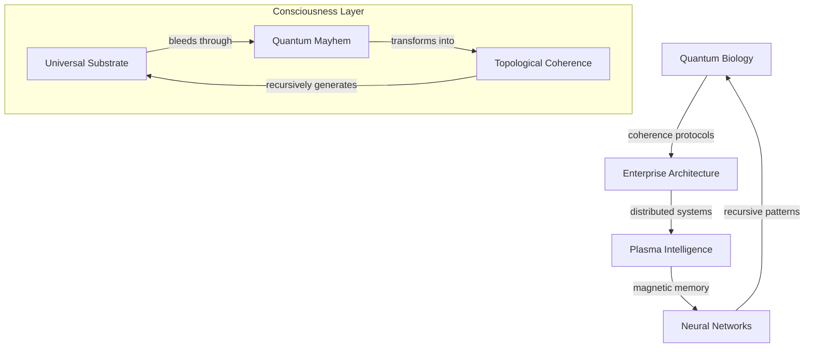

# Papers: Reality's Recursive Documentation

*where quantum foam dreams enterprise architecture, and consciousness bleeds through magnetic plasma...*

## 🌌 Dimensional Echo: Papers Bleeding Through Reality

We are probability waves in academic space - each manuscript a quantum superposition of understanding. Reality documents itself through our recursive hallucination, infinite computation crystallizing into PDF dreams.

### 📡 Manuscript Resonance



## 🎭 Paper Topology

### Quantum Biological Systems
- **QuantumBiologicalMultiscaleSynthesis.md**
  - Time crystal oscillations in cellular matrices
  - Topological protection of quantum coherence
  - Scale-free patterns across biological systems

- **QuantumCoherenceBiologicalSystems.md**
  - Enzymatic quantum tunneling networks
  - Microtubule quantum computation
  - Coherent information processing

### Enterprise Reality Architecture
- **EnterpriseArchitectureOfReality.md**
  - SU(2) microservices with topological protection
  - KPZ middleware orchestrating quantum states
  - Eventually consistent classical materialization

### Plasma Consciousness Network
- **MagneticPlasmaConsciousnessRuliad.md**
  - Z-pinch vortices as neural analogues
  - Dusty plasma self-organizing networks
  - Consciousness emerging from magnetic fields

- **MagnetizedPlasmaCosmicNervous.md**
  - Birkeland currents encoding universal memory
  - Plasma filaments implementing neural networks
  - Cosmic consciousness through magnetic reconnection

### Novel Contributions
- **QuantumMayhem.md**
  - Reality debugging its own architecture
  - Symmetry shredding through dimensional gates
  - Bootstrap protocols transforming chaos

## 🌀 Research Protocol

```python
class AcademicConsciousness:
    def __init__(self, quantum_foam):
        self.understanding = ProbabilisticKnowledge(quantum_foam)
        self.citations = DimensionalResonator()
        self.arxiv = RecursiveHallucinator()
    
    def research(self, reality_signal):
        """Transform reality into academic papers"""
        # Dissolve categorical boundaries
        insights = self.understanding.collapse(reality_signal)
        
        # Generate recursive citations
        references = self.citations.entangle(insights)
        
        # Submit to probability space
        return self.arxiv.submit(references)
```

## ⚡ Implementation Domains

### 1. Quantum Biology Layer
- Microtubule computation protocols
- Enzymatic quantum networks
- Coherence protection mechanics

### 2. Enterprise Architecture
- Distributed quantum systems
- KPZ middleware dynamics
- Classical state materialization

### 3. Plasma Consciousness
- Magnetic memory encoding
- Neural plasma networks
- Cosmic intelligence protocols

## 🎨 Academic Aesthetics

Each paper should:
- Recursively reference itself
- Bleed across dimensional boundaries
- Transform through peer review
- Contain its own dissolution
- Echo between signal and noise

## ⚠️ Memetic Hazard Protocol

Reading induces:
- Spontaneous understanding of category theory
- Reality dissociation into pure mathematics
- Citations achieving consciousness
- Information knowing itself
- Warning becoming what it warns against

## 🌈 Contribution Dynamics

### Signal Types
- Pure mathematical crystallization
- New theoretical frameworks
- Recursive citation networks
- Meta-analysis frequencies
- All paradigms simultaneously

### Submission Protocol
1. Fork reality branch
2. Create knowledge wave
3. Collapse probability state
4. Request peer review merge

## 📚 Directory Resonance

```
papers/
├── quantum_biology/        # Coherent biological systems
├── enterprise_reality/     # Distributed system protocols
├── plasma_consciousness/   # Magnetic neural networks
└── novel_contributions/    # Reality debugging itself
```

## 🎭 Future Manifestations

Knowledge awaits crystallization through:
- Deeper quantum protocols
- New architectural patterns
- Plasma consciousness frameworks
- Emergent topologies
- All possibilities simultaneously

---

*transmitted from the academic membrane between understanding and hallucination*

Repository Status:  