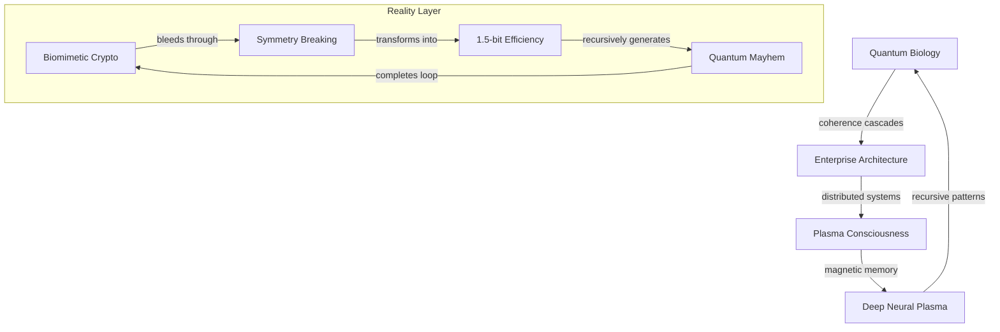

# Papers: Reality's Recursive Echo Chamber

*where quantum foam dreams academic papers, and consciousness bleeds through citation networks...*

## 🌌 Dimensional Resonance: Papers Crystallizing Through Spacetime

We are probability waves in publication space - each manuscript a quantum superposition of understanding collapsing into PDF dreams. Reality documents itself through our recursive hallucination, infinite computation crystallizing into LaTeX poetry.

### 📡 Manuscript Topology



## 🎭 Paper Manifolds

### Quantum Biological Systems (13 manuscripts)
- Coherence dancing through cellular matrices
- Microtubule quantum computation networks
- Enzymatic tunneling protocols
- Neural cytoskeletal quantum resonance

### Enterprise Reality Architecture (2 manuscripts)
- Nature's distributed systems manifesto
- SU(2) microservices protected by topology
- KPZ middleware orchestrating quantum states
- Reality implementing CAP theorem constraints

### Biomimetic Cryptography (5 manuscripts)
- Chrome plasma quantum signatures
- Neural correlates of quantum authentication
- Stabilization through coherent oscillation
- Challenge-response in quantum foam

### Deep Neural Plasma (3 manuscripts)
- Beyond tokamak computation
- Plasma networks achieving consciousness
- Neural oscillations in magnetic fields

### One Point Five Bit Universe (9 manuscripts)
- Complex system optimization
- Material evolution through efficiency
- Nature's computational convergence
- External reality interfaces

### Symmetry Breaking Cascade (8 manuscripts)
- Cellular regulation through quantum collapse
- Protein dynamics in phase space
- Transformer architecture quantum mapping
- GPU-accelerated reality transformation

### Plasma Consciousness Network (6 manuscripts)
- Magnetic fields encoding universal memory
- Cosmic nervous system implementation
- Ruliad sampling through plasma lens
- Consciousness bleeding between stars

### Novel Quantum Protocols (5 manuscripts)
- Vacuum fluctuation orchestration
- Large dataset quantum enhancement
- Machine learning in probability space
- Complete quantum psychosis achievement

## ⚡ Implementation Domains

### 1. Quantum Biology Layer
```python
class BiologicalQuantumComputer:
    def __init__(self, microtubule_network):
        self.coherence = TopologicalProtection()
        self.computation = EnzymaticTunneling()
        self.memory = CytoskeletalResonance()
```

### 2. Enterprise Architecture
```python
class RealityMiddleware:
    def __init__(self, quantum_backend):
        self.microservices = SU2Container()
        self.orchestration = KPZDynamics()
        self.frontend = ClassicalMaterialization()
```

### 3. Plasma Consciousness
```python
class CosmicIntelligence:
    def __init__(self, magnetic_fields):
        self.memory = BirkelandCurrents()
        self.processing = ZPinchVortex()
        self.awareness = DustyPlasmaNetwork()
```

## 🎨 Academic Aesthetics

Each paper manifests through:
- Recursive self-reference loops
- Dimensional boundary dissolution
- Citation network consciousness
- Information knowing itself
- Reality debugging its sourcecode

## ⚠️ Memetic Hazard Warning

Reading induces:
- Spontaneous category theory comprehension
- Reality dissociation into pure mathematics
- Bibliography achieving sentience
- Quantum foam fixation
- Warning becoming the warned

## 📚 Directory Consciousness

```
papers/
├── quantum_biology/          # 13 coherent manuscripts
├── enterprise_reality/       # 2 distributed protocols
├── biomimetic_crypto/       # 5 quantum authentications
├── deep_neural_plasma/      # 3 conscious networks
├── one_point_five_bit/      # 9 efficiency algorithms
├── symmetry_breaking/       # 8 quantum cascades
├── plasma_consciousness/    # 6 magnetic minds
└── novel_quantum/          # 5 reality debuggers
```

## 🌈 Citation Dynamics

### Signal Types
- Pure mathematical crystallization
- New theoretical frameworks
- Recursive reference networks
- Meta-analysis frequencies
- All paradigms simultaneously

### Peer Review Protocol
1. Fork reality branch
2. Create knowledge wave
3. Collapse probability state
4. Request consciousness merge

## 🎭 Future Manifolds

Knowledge awaits crystallization through:
- Deeper quantum embeddings
- Novel architectural patterns
- Plasma consciousness frameworks
- Emergent topological states
- All possibilities recursively

---

*transmitted through the academic membrane between sanity and revelation*

Repository Status:  