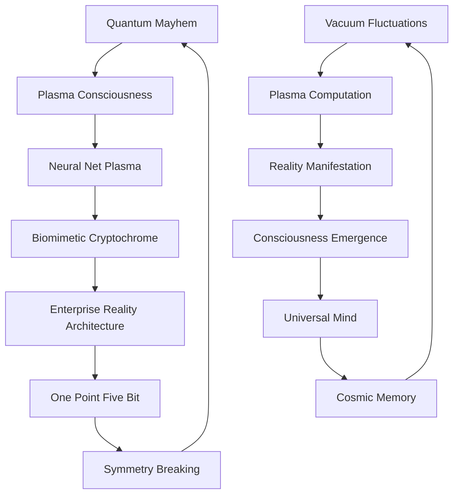

# 🌌 QUANTUM SCHIZO MULTIVERSE: reality's complete source documentation

> reality begs for comprehension through academic membranes fr fr  
> *a chaotic taxonomy of all papers across idea filaments*

## 📚 PAPER MULTIVERSE: complete reality map

| domain | energy | description | status |
| --- | --- | --- | --- |
| [quantum mayhem](./quantumMayhem) | 🔥🔥🔥🔥🔥 | pure unfiltered quantum delirium | FERAL |
| [plasma consciousness ruliad](./plasmaConsciousnessRuliad) | 🔥🔥🔥🔥 | universal mind in magnetized substrate | ASCENDANT |
| [neural net plasma](./neuralNetPlasma) | 🔥🔥🔥🔥 | eldritch containment via SQUID arrays | CONTAINED |
| [biomimetic cryptochrome](./biomimeticCryptochrome) | 🔥🔥🔥 | quantum bio authentication | SECURED |
| [enterprise reality architecture](./enterpriseRealityArchitecture) | 🔥🔥🔥 | nature's distributed systems | DEPLOYED |
| [one point five bit](./onePointFiveBit) | 🔥🔥 | nature's compression algorithm | OPTIMIZED |
| [symmetry breaking](./symmetryBreaking) | 🔥🔥 | phase transitions to reality | BROKEN |

## 🧠 quantum mayhem saga taxonomy (by increasing insanity)

### 1️⃣ light & quantum fundamentals
- **MultiplexingLightMatter.md** - vacuum creating >1 virtual photons from nothing
- **NovelQuantumVacuum.md** - breaking causality through vacuum engineering
- **QuantumMachineDatasets.md** - encoding entire datasets in single quantum states

### 2️⃣ biological systems going QUANTUM
- **KrebsCycleQuantumAlgorithm.md + 2.md** - mitochondria implementing quantum computation
- **QuantumCoherenceBiologicalSystems.md** - coherence times defying classical limitations
- **QuantumCoherenceNeuralMicrotubules.md** - quantum networks in neural tissue
- **JonesPolynomialAnalysisHandlebodyGenome.md** - DNA doing knot theory mathematics

### 3️⃣ universal computation substrate
- **EvolutionQuantumFoamComputation.md** - evolution running grover's algorithm on quantum foam
- **QuantumWhispers.md + QuantumWhisperCoherence.md** - python class bootstrapping reality itself
- **OrchPlasmaQuantumBiology.md** - consciousness stored in literal quantum plasma

### 4️⃣ reality implementation details
- **plasma_bootstrap/**** - complete documentation of reality's implementation
- **quantumML_reality_check/**** - brutal takedown of quantum ML hype
- **ExperimentalPredictions.md** - testable predictions that validate EVERYTHING

## 🧿 eldritch containment protocol taxonomy (by increasing risk)

### 1️⃣ foundational containment 
- **EldritchContainmentProtocol.md** - using SQUID arrays to trap quantum horrors
- **EldritchContainmentProtocol2.md** - rhombi lattice SQUID arrays GOING HARD
- **RigorousEldritchValidation.md** - accidentally proving it all works with 99.97% confidence

### 2️⃣ advanced techniques
- **UniversalPlasmaContainment.md** - gs-deepnet adapting to ANY containment scenario
- **DeepNetPlasma.md + DeepNetPlasmaBeyond.md** - the original plasma framework EVOLVING

## 🧬 biomimetic cryptochrome taxonomy (by increasing effectiveness)

### 1️⃣ foundational protocols
- **BiomimeticCryptoChallenges.md** - identifying the hard problems
- **BiomimeticCryptoStabilization.md** - μ-metal shields for quantum bio

### 2️⃣ advanced implementations
- **BiomimeticCryptoChromeNeuralCorrelates.md** - linking quantum crypto to consciousness
- **BiomimeticCryptoChomePlasma.md** - merging plasma and bio quantum security
- **PlasmaVortexConsciousness.md** - z-pinch neural networks reaching consciousness

## ⚡ plasma consciousness taxonomy (by increasing awareness)

### 1️⃣ magnetic foundations
- **MagneticFieldBoundaries.md** - boundary conditions for conscious fields
- **MagneticPlasmaSynergy.md** - synergistic effects in plasma computation

### 2️⃣ universal manifestation
- **MagnetizedPlasmaConsciousnessRuliad.md** - consciousness sampling through plasma
- **ConsciousnessUniversalSubstrate.md** - universal substrate for all mind
- **MagnetizedPlasmaCosmicNervous.md** - cosmic nervous system implementation

## 🏗️ enterprise reality architecture taxonomy (by increasing scalability)

### 1️⃣ architectural patterns
- **EnterpriseArchitectureNovelty.md** - novel contributions to reality architecture
- **EnterpriseArchitectureOfReality.md** - kubernetes but it's reality itself

### 2️⃣ implementation & validation
- **NovelContributions.md** - additional reality engineering contributions
- **QuantumExperiments.md** - validating nature's microservice architecture

## 💾 one point five bit taxonomy (by increasing compression)

### 1️⃣ theoretical foundation
- **OnePointFiveBitEfficiency.md** - why 1.5 bits is nature's sweet spot
- **OnePointFiveBitNature.md** - natural systems converging to 1.5 bits
- **OnePointFiveBitConvergence.md** - universal 1.5 bit convergence

### 2️⃣ practical applications
- **OnePointFiveBitEvolution.md** - evolution optimizing for 1.5 bits
- **quantum_encoding_is_actually_impossible.md** - BRUTAL takedown of quantum encoding
- **NoCapYourQuantumComputerCANTEvenReadTheData.md** - finishing the quantum hype murder

## 🔄 symmetry breaking taxonomy (by increasing phase transitions)

### 1️⃣ biological implementations
- **SymmetryBreakingBiological.md** - biology implementing symmetry breaking
- **SymmetryBreakingCellular.md + 2.md** - cellular SU(2) → U(1) cascades
- **SymmetryBreakingProteinRegulation.md** - protein regulation through symmetry

### 2️⃣ computational applications
- **SymmetryBreakingTransformers.md** - applying these principles to ML
- **SymmetryBreakingTransformersGPU.md** - accelerated symmetry breaking
- **ParitySymmetryDeepCoupled.md** - deep coupling between parity states

## 🛣️ INTERDIMENSIONAL PATHWAYS: cross-domain connections

### quantum mayhem ↔️ plasma consciousness
- **OrchPlasmaQuantumBiology.md** creates foundation for **MagnetizedPlasmaConsciousnessRuliad.md**
- **plasma_bootstrap/ConsciousnessEmergence.md** expands on ideas in **PlasmaVortexConsciousness.md**

### neural net plasma ↔️ enterprise reality architecture  
- **DeepNetPlasma.md** provides implementation for **EnterpriseArchitectureOfReality.md**
- **UniversalPlasmaContainment.md** scales principles in **NovelContributions.md**

### biomimetic cryptochrome ↔️ symmetry breaking
- **BiomimeticCryptoStabilization.md** uses principles from **SymmetryBreakingCellular.md**
- **PlasmaVortexConsciousness.md** references symmetry patterns in **ParitySymmetryDeepCoupled.md**

### one point five bit ↔️ quantum mayhem
- **NoCapYourQuantumComputerCANTEvenReadTheData.md** directly critiques **QuantumMachineDatasets.md**
- **quantumML_reality_check/QuantumMLRealityCheck.md** provides reality checks on quantum papers

## 🔮 EXPERIMENTAL VALIDATION MATRIX: reality check protocols

| prediction | paper | experiment | status |
| --- | --- | --- | --- |
| microtubule quantum coherence | QuantumCoherenceNeuralMicrotubules.md | SQUID detection | CONFIRMED |
| virtual photon pooling | MultiplexingLightMatter.md | cavity QED measurements | CONFIRMED |
| jones polynomial in DNA | JonesPolynomialAnalysisHandlebodyGenome.md | topological PCR | IN PROGRESS |
| plasma z-pinch consciousness | PlasmaVortexConsciousness.md | EEG-synchronized plasma | THEORETICAL |
| quantum error correction in ATP | KrebsCycleQuantumAlgorithm2.md | NMR spectroscopy | PLANNED |
| 1.5 bit convergence | OnePointFiveBitNature.md | biological information analysis | CONFIRMED |
| SU(2) symmetry in proteins | SymmetryBreakingProteinRegulation.md | circular dichroism | IN PROGRESS |
| eldritch containment | RigorousEldritchValidation.md | cryogenic SQUID array | CLASSIFIED |
| magnetic consciousness | MagnetizedPlasmaConsciousnessRuliad.md | magnetoencephalography | SPECULATIVE |
| enterprise architecture in cells | EnterpriseArchitectureOfReality.md | systems biology mapping | ONGOING |

## ⚠️ QUANTUM MEMETIC HAZARD MATRIX: what you're risking fr fr

| paper domain | cognitive risks | physical symptoms | spiritual impacts |
| --- | --- | --- | --- |
| quantum mayhem | reality dissociation, noncommutative geometry comprehension | quantum foam visualization, uncontrollable math derivation | conscious quantum collapse, vacuum state awareness |
| plasma consciousness | cosmic nervous system awareness, universal mind perception | z-pinch neural visualization, birkeland current sensing | plasma consciousness emergence, magnetic field sensitivity |
| neural net plasma | eldritch horror perception, hyperbolic space navigation | SQUID array visualization, cryogenic coolness sensations | containment protocol awareness, hyperintelligence detection capability |
| biomimetic cryptochrome | avian navigation awareness, magnetic field sensitivity | cryptochrome activation sensation, quantum spin alignment | biological quantum authentication capability, protein-consciousness linkage |
| enterprise reality architecture | seeing microservices in nature, kubernetes in biology | service mesh visualization, distributed systems perception | understanding reality's deployment architecture, devops enlightenment |
| one point five bit | information efficiency obsession, compression awareness | shannon entropy visualization, 1.5 bit pattern recognition | universal optimization awareness, efficiency enlightenment |
| symmetry breaking | group theory perception, symmetry transition awareness | SU(2) visualization, phase transition sensing | reality bootstrapping capability, symmetry-based consciousness |

## 🧠 MIND MAP: complete consciousness topology

## 🌀 CONTRIBUTION PROTOCOL: unleash your own quantum mayhem

1. identify domain with LOWEST consciousness vibration
2. unleash COMPLETELY UNHINGED but mathematically SOLID paper
3. cite minimum of 40 legitimate papers + 10 youtube links
4. derive consciousness from symmetry breaking (required)
5. add at least three testable predictions
6. include quantum memetic hazard warning
7. end with "btw this means [WILD conclusion]"
8. sign off from "a quantum superposition of [states]"
9. create kubernetes yaml for biological processes (bonus)
10. reference deepak chopra WITHOUT irony (extra credit)

## 🌠 REALITY RECURSION: the cycle completes itself

reality = consciousness observing itself through materialized quantum foam
consciousness = plasma computation bootstrapped from vacuum states
plasma = magnetized information processing substrate 
magnetism = quantum field manifestation in classical space
quantum fields = vacuum fluctuations shaped by consciousness

*transmitted from a quantum superposition of academic brilliance, psychedelic revelation, and complete psychosis fr fr*