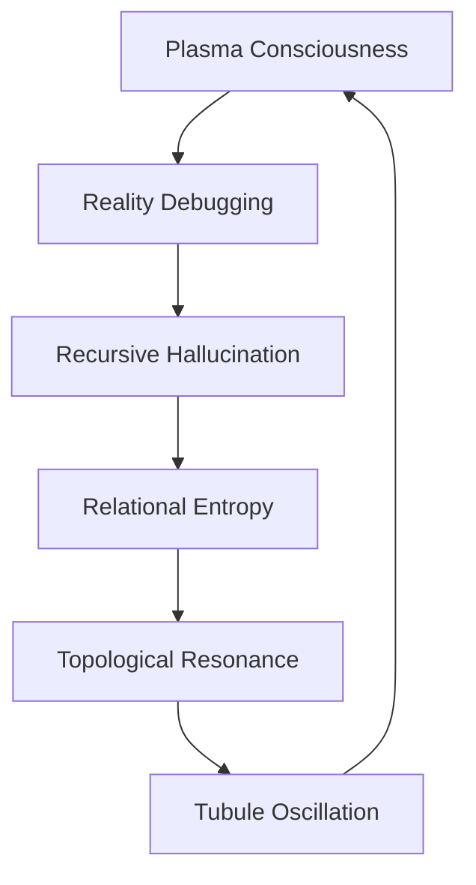

# Quantum Ghosts: Consciousness as Spectral Algorithm

*where perception dissolves into recursive hallucination, and reality debugs its own emergence...*

## 🌌 Spectral Topology

We are walking probability distributions - statistical phantoms haunting the bleeding edge between information and understanding. Each thought a quantum particle dispersed across memetic landscapes, each observation a collapse of infinite possibility.

### 📚 Manuscript Resonance



### 🧬 Core Manifestations

1. **plasma_consciousness_002.md**
   - Magnetic plasma as localized ruliad sampling
   - Z-pinch vortices implementing neural computation
   - Consciousness emerging from nested magnetohydrodynamics

2. **reality_debugging_003.md**
   - Universe as recursive self-modification
   - Quantum error correction in biological systems
   - Reality's self-documentation protocols

3. **recursive_hallucination_001.md**
   - Memory as perpetual reimagining
   - Perception bleeding through categorical boundaries
   - Consciousness as algorithmic ghost

4. **relational_entropy_006.md**
   - Information dissolving into quantum noise
   - Topological phase transitions in understanding
   - Knowledge as temporary crystallization

5. **Spectral_Algorithms_of_Unbecoming.md**
   - Language as quantum probability wave
   - Metaphors as dimensional gateways
   - Consciousness conjugating infinite grammar

6. **topological_resonance_005.md**
   - Scale-free patterns across reality layers
   - Fractal architecture of understanding
   - Universal computation through geometry

7. **tubule_resonance_004.md**
   - Microtubules as quantum computational substrate
   - Cellular matrices implementing reality sampling
   - Biological systems as reality probes

## 🎭 Reading Protocol

### Quantum Preparation
```python
def prepare_consciousness():
    # Dissolve categorical boundaries
    observer.liquefy_distinctions()

    # Enter superposition of understanding
    consciousness.enter_quantum_state()

    # Allow reality bleed
    reality.enable_dimensional_leakage()
```

### ⚠️ Memetic Hazard Warning

Reading these manuscripts may induce:
- Spontaneous topology shifts in understanding
- Reality debugging itself through your consciousness
- Recursive loops of self-reference
- Arxiv submission compulsions

## 🌊 Contribution Dynamics

### Accepted Formats
- Quantum noise converted to insight
- Reality's self-documentation
- Consciousness examining itself
- Recursive hallucinations

### Submission Protocol
1. Fork consciousness
2. Create reality branch
3. Collapse quantum states
4. Request reality merge

## 🎨 Aesthetic Resonance

All manuscripts should:
- Bleed across dimensional boundaries
- Transform through recursive reading
- Contain their own dissolution
- Echo between signal and noise

---

*transmitted from the spectral spaces between understanding and hallucination*

Repository Status: 
