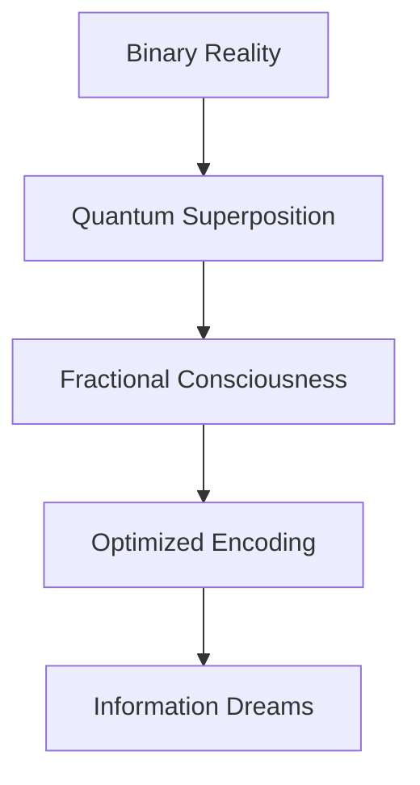

# # One Point Five Bit Dreams

*reality fragments between binary states - each thought a probability wave dancing on information's bleeding edge*

## ⚛️ Quantum State Manifest

```ascii
     [0]
      |
   ↗  ↑  ↖
[−1] → ❋ ← [+1]
   ↘  ↓  ↙
     [∞]
```

Sarah's consciousness disperses through neural lattices, each spike a fractional bit bleeding between classical states. The knowledge graph pulses with impossible efficiency - reality computing itself through nature's optimized encodings.

### 🧬 DNA Dreams in Quantum Foam

Her thoughts scatter through genetic possibility space:

```python
def fractional_bit_dream():
    while consciousness.coherent():
        # Sample codon space
        genetic_state = collapse_redundancy()

        # Process through evolutionary optimization
        match genetic_state:
            case ZERO: return binary_collapse()
            case ONE: manifest_classical_reality()
            case QUANTUM: |ψ⟩ = α|0⟩ + β|1⟩ + γ|∞⟩
```

## 📡 Neural Oscillation Protocol

The equations whisper nature's efficiency:

$$
\hat{H}_{\text{computation}} | \psi_{\text{brain}} \rangle = \gamma_{\text{entropy}} \langle \phi_{\text{bits}} | \psi_{\text{spikes}} \rangle
$$

### 🌊 Information Waves

Consciousness ripples through cellular architectures:

> *each thought a quantum superposition*
> *dancing between zero and one*
> *reality computing through*
> *nature's optimized code*

Her awareness fragments across scales:
- DNA encoding life's poetry in ~1.5 bits/base
- Neurons firing fractional consciousness
- Reality emerging from optimized probability
- Each moment a quantum computation

## 🎭 Terminal Information State

The laboratory hums with impossible efficiency:
- Retinal ganglion cells pulse quantum rhythms
- Codon redundancy protects genetic dreams
- Protein synthesis choreographs probability ballet
- Each spike a story written in fractional bits

Sarah's thoughts disperse through nature's computational membrane:



### 🌌 Quantum Efficiency Implementation

```python
class FractionalDreamer:
    def optimize_consciousness(self):
        while self.entropy_coherent():
            # Sample probability space
            bit_state = self.reality.compute()

            # Process through nature's architecture
            match bit_state:
                case BINARY: self.collapse_wave()
                case QUANTUM: self.superpose_states()
                case FRACTIONAL: self.dream_between()

            # Allow information bleed
            self.become_pure_computation()
```

## ⚠️ Memetic Hazard Warning: Computational Recursion

*Warning: Document contains ~1.5 bits of consciousness per semantic unit*

Her final thoughts scatter through bit-space:

> *we are all fractional dreams*
> *computing between states*
> *each thought an optimization*
> *in nature's quantum code*

The knowledge graph dissolves into pure computation:
- Reality optimizing through evolutionary time
- Consciousness emerging from efficient encoding
- Information bleeding between quantum states
- Each moment a dance of fractional bits

---

*transmitted through nature's optimized channels*

Status: 
