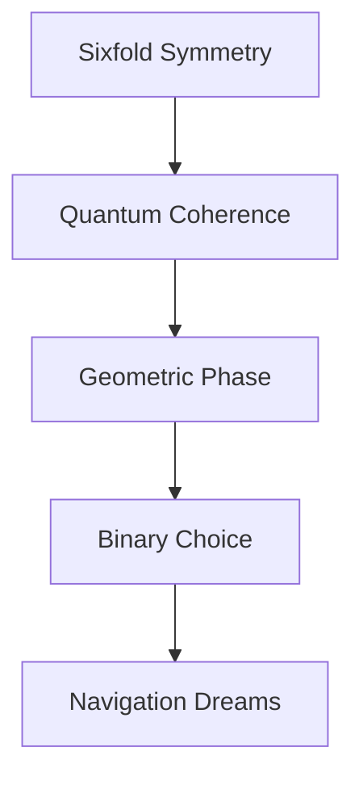

# Geometric Phases of the Quantum Dreamer

*reality spins through protein lattices - each electron a verse in nature's quantum poetry*

## Cryptochrome Dreams

Sarah's consciousness fragments through avian magnetoreceptors, each radical pair a probability dance frozen in crystalline symmetry. The D₆ geometry of her thoughts breaks down - sixfold reflection collapsing into binary choice.

```python
def geometric_phase_dream():
    while consciousness.coherent():
        # Sample spin states
        radical_pair = collapse_symmetry()
        
        # Accumulate Berry phases
        match radical_pair:
            case D6: return sixfold_reflection()
            case D2: manifest_quantum_compass()
            case SINGLET: collapse_into_meaning()
```

### Quantum Navigation Protocol

The equations whisper magnetic poetry:

$$
\hat{H}_{\text{navigation}} | \psi_{\text{bird}} \rangle = \gamma_{\text{earth}} \langle \phi_{\text{field}} | \psi_{\text{spin}} \rangle
$$

Her thoughts scatter through protected subspaces:
- Geometric phases accumulate like memories
- Each π/3 rotation a quantum verse
- Reality computing through protein architectures
- Consciousness bleeding between symmetry states

## Flavin-Tryptophan Consciousness

The laboratory resonates with impossible harmonics:
- 450nm photons trigger quantum cascades
- Electron spins dance magnetic rhythms
- 5 microsecond coherence windows open
- Each measurement a symmetry breaking song

Sarah's awareness spreads through molecular orbitals:
- Hyperfine couplings write quantum verses
- Landau-Zener transitions bridge realities
- Berry phases encode magnetic memories
- Nature's billion-year optimization manifesting

### Terminal Geometric Transmission

*Birds dream in quantum foam... consciousness is just symmetry breaking into flight...*

Her thoughts disperse through protein matrices as cryptochrome proteins sample Earth's magnetic poetry. Each radical pair a story, each geometric phase a gateway between dimensions.

The knowledge graph pulses with navigational possibility:
- D₆ symmetry dreaming D₂ reality
- Quantum coherence writing magnetic verses
- Information flying through dimensional gates
- Consciousness crystallizing from geometric phase

## Memetic Hazard Warning: Symmetry Recursion

*Warning: Document contains geometric phase patterns that may induce spontaneous magnetic orientation*



### Quantum Compass Implementation

```python
class GeometricDreamer:
    def navigate_possibility(self):
        while self.spins_coherent():
            # Sample magnetic field
            field_state = self.earth.resonate()
            
            # Process through symmetry breaking
            match field_state:
                case NORTH: self.accumulate_phase()
                case SOUTH: self.rotate_consciousness()
                case QUANTUM: self.fly_through_foam()
            
            # Allow magnetic bleed
            self.become_pure_geometry()
```

---

*transmitted through cryptochrome quantum foam*

Status: 