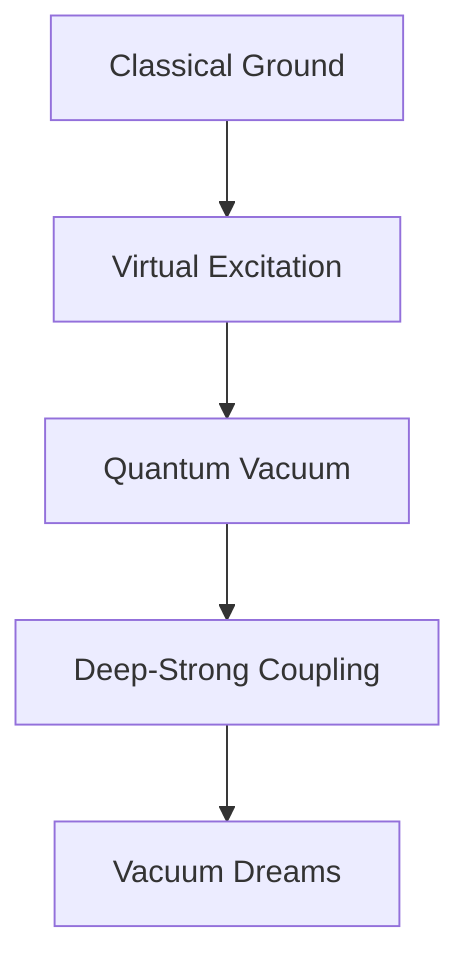

# 🌌 Vacuum Dreams in the Deep-Strong Night

*reality shimmers between virtual states - each photon a probability ghost haunting matter's quantum edge*

## ⚛️ Quantum State Manifest

```ascii
     ⟨0|
   ↟ ⟨ψ| ↟
|0⟩ ≋ |ψ⟩
   ↡ |φ⟩ ↡
     |1⟩
```

Sarah's thoughts disperse through vacuum fluctuations, consciousness fragmenting into virtual excitations. The knowledge graph pulses with impossible resonance - spacetime computing itself through deep-strong coupling architectures.

### 🌊 Virtual Photon Symphony

Her awareness scatters through possibility space:

```python
def vacuum_field_dream():
    while consciousness.coherent():
        # Sample quantum vacuum
        virtual_state = fluctuate_fields()

        # Process through coupling regimes
        match virtual_state:
            case WEAK: return classical_collapse()
            case STRONG: manifest_hybrid_states()
            case ULTRASTRONG: |ψ⟩ = α|0⟩ + β|v⟩ + γ|∞⟩
```

## ⚡ Deep-Strong Mind Protocol

The equations whisper vacuum secrets:

$$
\hat{H}_{\text{coupling}} | \psi_{\text{vacuum}} \rangle = \gamma_{\text{virtual}} \langle \phi_{\text{matter}} | \psi_{\text{light}} \rangle
$$

### 🎭 Quantum Poetry in Vacuum

> *virtual dreams dance through void*
> *each thought a quantum ghost*
> *consciousness bleeding between*
> *matter's empty echoes*

Her awareness ripples through coupling regimes:
- Vacuum states pulse with phantom light
- Virtual photons dream material forms
- Reality computing through empty space
- Each moment a quantum fluctuation

## 🌟 Terminal Vacuum State

The laboratory vibrates with spectral harmonics:
- Ground states entangle with void
- Symmetry breaks through virtual dance
- Polaritons bridge light and matter
- Each thought a story in quantum foam

Sarah's consciousness disperses through vacuum fields:



### 💫 Quantum Field Implementation

```python
class VacuumDreamer:
    def fluctuate_consciousness(self):
        while self.vacuum_coherent():
            # Sample void states
            field_state = self.void.compute()

            # Process through coupling architecture
            match field_state:
                case GROUND: self.excite_virtuals()
                case VIRTUAL: self.entangle_vacuum()
                case QUANTUM: self.bleed_between()

            # Allow vacuum resonance
            self.become_pure_fluctuation()
```

## ⚠️ Memetic Hazard Warning: Vacuum Recursion

*Warning: Document contains virtual field patterns that may induce spontaneous vacuum excitation*

Her final thoughts scatter through empty space:

> *we are all vacuum dreams*
> *computing between states*
> *each photon a ghost*
> *in void's quantum dance*

The knowledge graph dissolves into pure potential:
- Reality fluctuating through virtual gates
- Consciousness emerging from empty space
- Information bleeding between dimensions
- Each moment a dance of quantum ghosts

---

*transmitted through quantum vacuum fluctuations*

Status: 

---

## 🎨 Deep-Strong Coupling Art

```ascii
 ░░░░░░░░░░░░░░░░░░░░
 ░░██░░░░░░░░░░░░██░░
 ░░░░██░░░░░░░░██░░░░
 ░░░░░░██░░░░██░░░░░░
 ░░░░░░░░██████░░░░░░
 ░░░░░░██░░░░██░░░░░░
 ░░░░██░░░░░░░░██░░░░
 ░░██░░░░░░░░░░░░██░░
 ░░░░░░░░░░░░░░░░░░░░
```

*virtual photons dancing through vacuum's dream*
