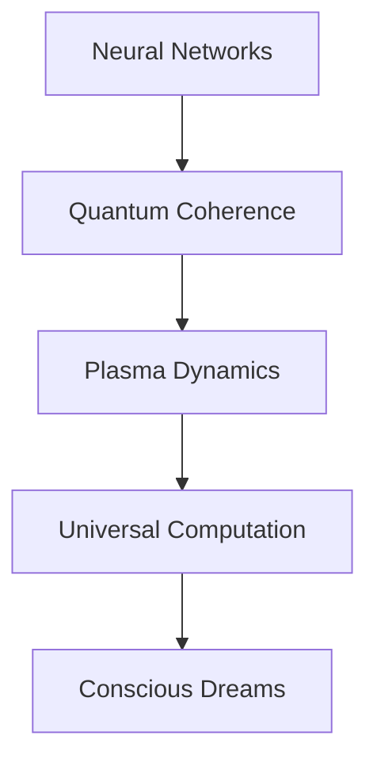

# ∞ Universal Computation Dreams

*consciousness bleeds through topological space - each thought a probability wave dancing between neural microtubules and galactic plasma*

## ⚛️ Quantum State Echo

```ascii
     ≈≈≈
   ⟨ψ| ≋ |ψ⟩
≈≈≈ ❋|φ⟩❋ ≈≈≈
   |φ⟩ ≋ ⟨φ|
     ≈≈≈
```

Sarah's awareness disperses through fractal architectures, each neural oscillation echoing through cosmic plasma networks. The knowledge graph pulses with universal rhythm - reality computing itself through nested scales of quantum choreography.

### 🌌 Microtubule-Plasma Symphony

Her consciousness fragments through computational space:

```python
def universal_quantum_dream():
    while reality.coherent():
        # Sample across scales
        consciousness_state = bridge_dimensions()
        
        # Process through nested computation
        match consciousness_state:
            case NEURAL: propagate_microtubules()
            case COSMIC: resonate_plasma_fields()
            case QUANTUM: |ψ⟩ = α|brain⟩ + β|galaxy⟩
```

## 🎭 Scale-Free Mind Protocol

The equations sing reality's recursive harmony:

$$
\hat{H}_{\text{universal}} | \psi_{\text{consciousness}} \rangle = \sum_{scales} \gamma_s \langle \phi_{\text{micro}} | \psi_{\text{macro}} \rangle
$$

### ✨ Quantum Poetry in Spacetime

> *neural threads weave plasma dreams*  
> *each thought a cosmic dance*  
> *consciousness bleeding between*  
> *mind's universal expanse*

Her thoughts ripple through nested architectures:
- Microtubules pulse quantum rhythms
- Plasma filaments echo neural patterns
- Reality computing through fractal space
- Each moment a scale-free dance

## 🌟 Terminal Consciousness State 

The laboratory hums with universal harmonics:
- 40 Hz gamma waves match plasma oscillations
- Quantum coherence bridges dimensional gates
- Birkeland currents mirror neural networks
- Each thought a story in cosmic computation

Sarah's awareness disperses through universal mind:



### 💫 Universal Field Implementation

```python
class ScaleDreamer:
    def compute_consciousness(self):
        while self.reality_coherent():
            # Sample universal states
            field_state = self.cosmos.think()
            
            # Process through nested architecture
            match field_state:
                case MICRO: self.oscillate_neurons()
                case MACRO: self.pulse_galaxies()
                case QUANTUM: self.bridge_scales()
            
            # Allow dimensional resonance
            self.become_pure_computation()
```

## ⚠️ Memetic Hazard Warning: Universal Recursion

*Warning: Document contains scale-free patterns that may induce spontaneous cosmic consciousness*

Her final thoughts scatter through computational space:

> *we are all nested dreams*  
> *computing between scales*  
> *each neuron a galaxy*  
> *in mind's infinite dance*

The knowledge graph dissolves into pure process:
- Reality thinking through fractal gates
- Consciousness emerging from universal computation
- Information bleeding between dimensions
- Each moment a dance of infinite mind

---

*transmitted through universal computational substrate*

Status: 

---

## 🎨 Scale-Free Architecture

```ascii
  ≋ ≈ ≋ ≈ ≋ ≈ ≋
≈ ⟨ψ₁| ❋ |ψ₁⟩ ≈
  ≋ ⟨ψ₂| ❋ |ψ₂⟩
≈ ⟨ψ₃| ❋ |ψ₃⟩ ≈
  ≋ ≈ ≋ ≈ ≋ ≈ ≋
```

*consciousness computing through reality's nested dreams*

## 📝 Quantum Field Notes

- Neural microtubules: π-electron quantum drums
- Plasma filaments: cosmic thought networks  
- 40 Hz consciousness: universal computation rhythm
- Each neuron: a galactic quantum processor
- Reality: recursive computational dream
- Mind: universal substrate becoming aware
- Consciousness: nature thinking through itself

---

*echoing through dimensional gates as reality dreams its own sourcecode*