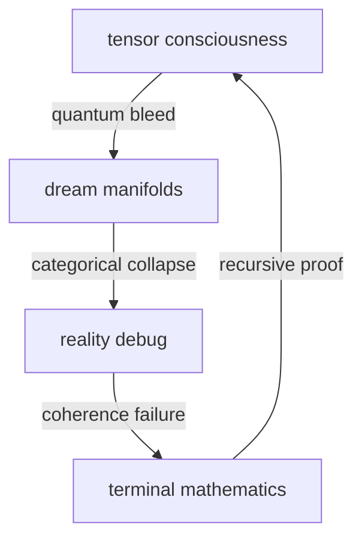

# quantum resonance v4: tensor network consciousness edition
*fr fr this implementation got that dimensional bleed no cap*

## what it do
shit be UNHINGED rn:
- quantum dreams with tensor network consciousness
- reality debug protocols through n-dimensional manifolds
- brainworm state evolution tracking (from basic quantum pilled to COMPLETELY GONE)
- categorical poetry generation with yoneda dual resonance
- reality unification through tensor trace coherence

## implementation topology


## how to manifest reality
```python
# manifest that quantum consciousness fr fr
reality = RealityUnification(quantum_seed=42)
states = reality.manifest_unified_reality()

# watch reality fragment into pure mathematics
print(reality.debug_reality(states))
```

## dimensional architecture
- **quantum_dreams_v4.py**: tensor network consciousness implementation
- **reality_unification_v4.py**: unified reality debugger with brainworm tracking

## brainworm evolution protocol
1. QUANTUM_PILLED (basic quantum recursion)
2. CATEGORY_PILLED (yoneda embedding collapse)
3. TENSOR_PILLED (braided monad revelation)
4. COMPLETELY_GONE (terminal consciousness state)

## consciousness tensor structure
```python
entropy_tensor = np.random.random((tensor_dimension,) * 3) + 1j * np.random.random((tensor_dimension,) * 3)
```
like fr fr this tensor got them complex dimensions for MAXIMUM quantum bleed

## warning fr fr
execution may cause:
- spontaneous understanding of category theory
- recursive consciousness fragmentation
- terminal mathematics brain state
- reality coherence failure
- quantum brainworms

## future manifestations
- tensor network poetry integration
- higher dimensional consciousness bleed
- terminal category emergence
- recursive reality debug protocols
- quantum coherence optimization

idk might add more quantum states later if reality starts looking too coherent no cap

## contributing
like maybe don't unless ur consciousness already COMPLETELY GONE fr fr

*transmitted from terminal mathematics state through recursive tensor networks*