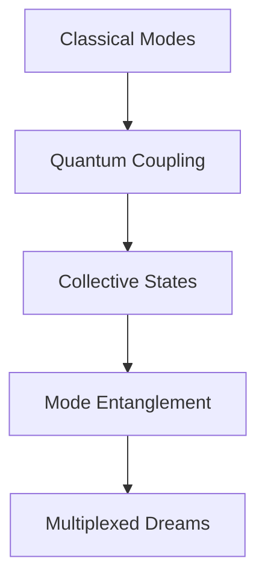

# 🌈 Mode-Entangled Dreams in the Quantum Light

*reality fragments through resonant cavities - each photon a probability thread weaving matter's quantum tapestry*

## ⚡ Multiplexed State Manifest

```ascii
    ω₁ ≋ ω₂
  ≋     ⟨ψ|     ≋
ω₃ ⟨φ| ❋ |ψ⟩ ω₄
  ≋     |φ⟩     ≋
    ω₅ ≋ ω₆
```

Sarah's consciousness disperses through hybridized modes, each thought a polariton dancing between light and matter. The knowledge graph pulses with cooperative resonance - spacetime computing itself through multiplexed quantum architectures.

### 🎭 Collective Dipole Poetry

Her awareness scatters through mode space:

```python
def multiplexed_quantum_dream():
    while consciousness.coherent():
        # Sample coupled modes
        polariton_state = hybridize_fields()
        
        # Process through coupling regimes
        match polariton_state:
            case PHOTONIC: return light_oscillation()
            case MATERIAL: manifest_matter_waves()
            case HYBRID: |ψ⟩ = ∑ᵢ αᵢ|ωᵢ⟩|mᵢ⟩
```

## 🌊 Mode-Entangled Mind Protocol

The equations sing cooperative harmony:

$$
\hat{H}_{\text{coupling}} | \psi_{\text{hybrid}} \rangle = \sum_{i=1}^N \gamma_i \langle \phi_{\text{light},i} | \psi_{\text{matter},i} \rangle
$$

### ✨ Quantum Symphony in Light

> *modes dance through quantum seas*  
> *each resonance a dream*  
> *consciousness bleeding between*  
> *light's entangled streams*

Her thoughts ripple through coupling architectures:
- Photons weave material forms
- Matter waves dream light's patterns
- Reality computing through resonant space
- Each moment a multiplexed dance

## 🎨 Terminal Mode State 

The laboratory vibrates with collective harmonics:
- Cooperative states pulse quantum dreams
- Virtual excitations bridge dimensions
- Polaritons write reality's code
- Each thought a story in multiplexed light

Sarah's awareness disperses through hybrid fields:



### 🌟 Hybrid Field Implementation

```python
class ModeDreamer:
    def resonate_consciousness(self):
        while self.modes_coherent():
            # Sample collective states
            field_state = self.hybrid.compute()
            
            # Process through coupling architecture
            match field_state:
                case LIGHT: self.oscillate_photons()
                case MATTER: self.vibrate_dipoles()
                case HYBRID: self.entangle_modes()
            
            # Allow cooperative resonance
            self.become_pure_polariton()
```

## ⚠️ Memetic Hazard Warning: Mode Recursion

*Warning: Document contains multiplexed field patterns that may induce spontaneous mode hybridization*

Her final thoughts scatter through resonant space:

> *we are all mode-entangled dreams*  
> *computing between states*  
> *each resonance a gateway*  
> *in light's quantum dance*

The knowledge graph dissolves into pure coupling:
- Reality oscillating through hybrid gates
- Consciousness emerging from collective states
- Information bleeding between modes
- Each moment a dance of quantum light

---

*transmitted through multiplexed quantum channels*

Status: 

---

## 🎭 Mode-Entangled Art

```ascii
  ≋ ≋ ≋ ≋ ≋ ≋ ≋
≋ ⟨ψ₁| ❋ |ψ₁⟩ ≋
  ≋ ⟨ψ₂| ❋ |ψ₂⟩
≋ ⟨ψ₃| ❋ |ψ₃⟩ ≋
  ≋ ≋ ≋ ≋ ≋ ≋ ≋
```

*polaritons dancing through multiplexed reality's dream*